# IKB42603 Lab 1: Cloud Account Security, Identity and Access Management

**Course:** IKB42603 Cloud Computing Security Essentials
**Lab:** Lab 1 - Account Security and IAM
**Student Name:** WAN MUHAMMAD NUR IMAN BIN WAN ISMAIL
**Student ID:** 52215225039
**Date:** 29 July 2026
**Environment:** Kali Linux, LocalStack, and kind Kubernetes

## Objective

This lab applied identity governance and least-privilege access control using LocalStack IAM and Kubernetes RBAC. LocalStack simulated AWS IAM locally, while kind provided a Kubernetes cluster for namespace and Role-Based Access Control (RBAC) testing.

## Lab Summary

- Created an `Admins` IAM group and assigned administrator access through group membership.
- Created `CloudAdmin_iman` as the personal administrator and added it to `Admins`.
- Created `Analyst_iman` with only the `AmazonS3ReadOnlyAccess` managed policy.
- Created and deactivated a LocalStack access key without exposing its secret value.
- Created a separate `ccse-lab1` kind cluster with `dev` and `prod` namespaces.
- Applied a namespaced Kubernetes Role and RoleBinding to allow pod reading only in `dev`.

## Evidence Folder

All screenshots for this report are stored in `Evidence/`.

| Evidence file | Purpose |
| --- | --- |
| `localstack-identity.png` | LocalStack STS identity verification |
| `admin-group-policy.png` | Admins group creation and AdministratorAccess policy |
| `admin-user-created.png` | CloudAdmin_iman user creation |
| `admin-group-membership.png` | CloudAdmin_iman membership in Admins |
| `analyst-readonly-policy.png` | Analyst_iman creation and S3 read-only policy |
| `access-key-lifecycle.png` | Access key creation, listing, and deactivation |
| `lab1-cluster-ready.png` | ccse-lab1 kind cluster verification |
| `dev-prod-namespaces.png` | dev and prod namespace creation |
| `role-and-rolebinding.png` | Service account, Role, and RoleBinding creation |
| `rbac-access-tests.png` | RBAC allow and deny results |
| `rolebinding-yaml.png` | RoleBinding YAML verification |

## Task 1: Cloud Identity Landscape

| Concept | AWS term | Purpose |
| --- | --- | --- |
| Account owner | Root user | The original account identity with unrestricted control. It should not be used for daily administration. |
| Human or application identity | IAM user | A named identity with credentials and permissions. |
| Permission document | IAM policy | Defines allowed or denied actions on resources. |
| Permission collection | IAM group | Manages shared user permissions by attaching policies to a group. |
| Temporary identity | IAM role | Grants short-lived permissions to trusted users, applications, or services. |

## Session A: LocalStack IAM

### Environment Setup

The AWS CLI was configured to use the LocalStack endpoint instead of a real AWS account.

```bash
EP='--endpoint-url=http://localhost:4566'
ADMIN_USER='CloudAdmin_iman'
ANALYST_USER='Analyst_iman'

aws $EP sts get-caller-identity
```

The command returned the LocalStack account ID `000000000000`, confirming that subsequent IAM commands were executed locally.

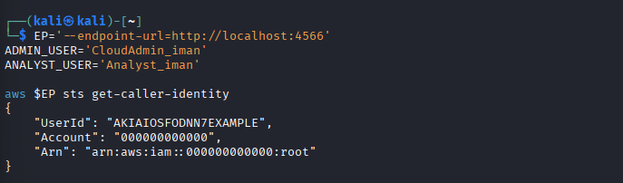

## Task 2: Create a Least-Privilege Admin

### Step 2.1: Create the Admins Group

```bash
aws $EP iam create-group --group-name Admins
```

### Step 2.2: Attach Administrator Access to the Group

```bash
aws $EP iam attach-group-policy \
  --group-name Admins \
  --policy-arn arn:aws:iam::aws:policy/AdministratorAccess

aws $EP iam list-attached-group-policies --group-name Admins
```

The output confirmed that `AdministratorAccess` was attached to the `Admins` group.

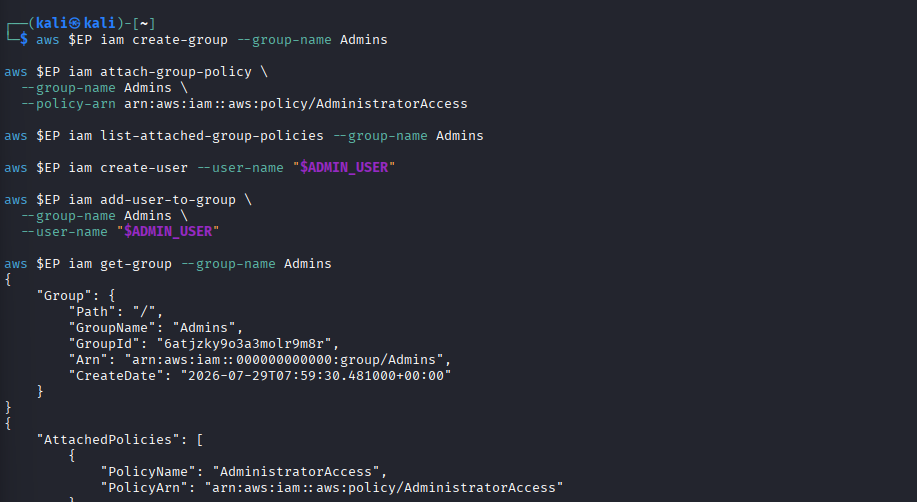

### Step 2.3: Create a Personal Administrator

```bash
aws $EP iam create-user --user-name "$ADMIN_USER"
```

The user `CloudAdmin_iman` was created successfully.

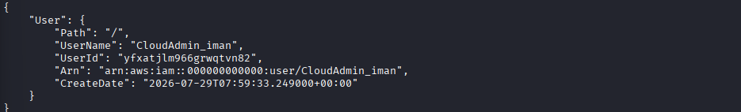

### Step 2.4: Add the Administrator to the Group

```bash
aws $EP iam add-user-to-group \
  --group-name Admins \
  --user-name "$ADMIN_USER"

aws $EP iam get-group --group-name Admins
```

The group output listed `CloudAdmin_iman` as a member. The user receives administrator permissions through group membership rather than through a policy attached directly to the user.

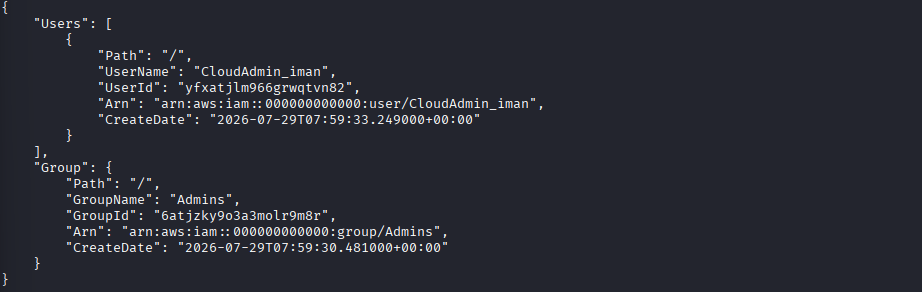

## Task 3: Enforce Least Privilege with a Scoped Policy

### Step 3.1: Create the Analyst User

```bash
aws $EP iam create-user --user-name "$ANALYST_USER"
```

### Step 3.2: Attach S3 Read-Only Access

```bash
aws $EP iam attach-user-policy \
  --user-name "$ANALYST_USER" \
  --policy-arn arn:aws:iam::aws:policy/AmazonS3ReadOnlyAccess

aws $EP iam list-attached-user-policies --user-name "$ANALYST_USER"
```

The output confirmed that `Analyst_iman` was assigned `AmazonS3ReadOnlyAccess` only.

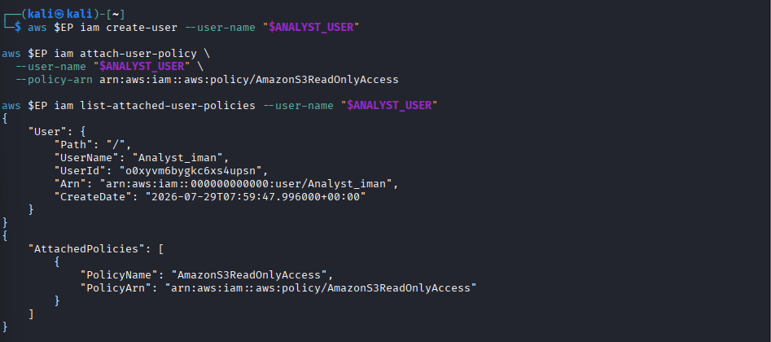

### Least-Privilege Explanation

If `Analyst_iman` is compromised, the attacker is limited to S3 read-only actions. The identity cannot create IAM users, change policies, delete resources, or gain administrative control. This reduces the blast radius of a compromised account.

## Task 4: Credential Hygiene and Access Keys

An access key was created for `Analyst_iman` while filtering the command output so that the secret access key was not displayed or stored in the evidence.

```bash
ACCESS_KEY_ID="$(aws $EP iam create-access-key \
  --user-name "$ANALYST_USER" \
  --query 'AccessKey.AccessKeyId' \
  --output text)"

aws $EP iam list-access-keys --user-name "$ANALYST_USER"

aws $EP iam update-access-key \
  --user-name "$ANALYST_USER" \
  --access-key-id "$ACCESS_KEY_ID" \
  --status Inactive

aws $EP iam list-access-keys --user-name "$ANALYST_USER"
```

The first listing showed the key as `Active`; the final listing showed it as `Inactive`. This demonstrates key rotation and deactivation practices. The secret access key was not included in this report or its screenshots.

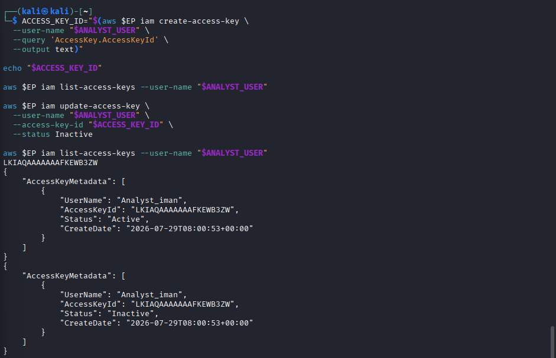

## Session B: Kubernetes RBAC

### Kubernetes Cluster Setup

```bash
kind create cluster --name ccse-lab1
kubectl cluster-info --context kind-ccse-lab1
kubectl get nodes
```

The `ccse-lab1-control-plane` node reached the `Ready` state.

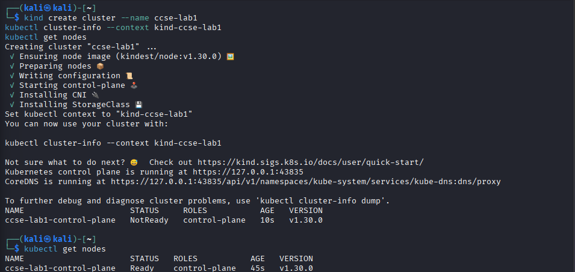

## Task 5: Separate Environments with Namespaces

```bash
kubectl create namespace dev
kubectl create namespace prod
kubectl get namespaces
```

Both namespaces were created and reported as `Active`.

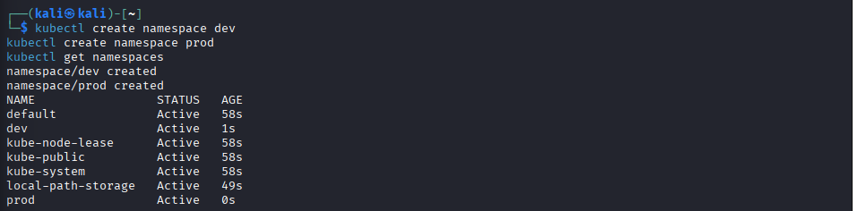

## Task 6: Define a Role and Bind It

### Step 6.1: Create a Service Account

```bash
kubectl create serviceaccount dev-user -n dev
```

### Step 6.2: Create a Pod Reader Role

```bash
kubectl create role pod-reader -n dev \
  --verb=get,list,watch \
  --resource=pods
```

### Step 6.3: Create a RoleBinding

```bash
kubectl create rolebinding dev-user-binding -n dev \
  --role=pod-reader \
  --serviceaccount=dev:dev-user
```

The `pod-reader` Role permits only `get`, `list`, and `watch` actions on pods in the `dev` namespace. The RoleBinding grants these permissions to the `dev-user` service account.

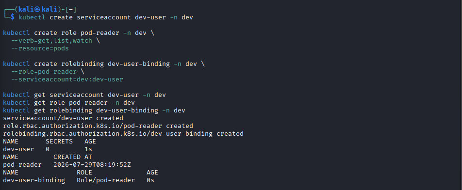

## Task 7: Test Access Control

```bash
SA='system:serviceaccount:dev:dev-user'

kubectl auth can-i list pods -n dev --as="$SA"
kubectl auth can-i delete pods -n dev --as="$SA"
kubectl auth can-i list pods -n prod --as="$SA"
```

Results:

```text
yes
no
no
```

- The service account can list pods in `dev` because the Role permits `list` on pods in that namespace.
- The service account cannot delete pods because the Role does not grant `delete`.
- The service account cannot list pods in `prod` because the Role and RoleBinding apply only to `dev`.

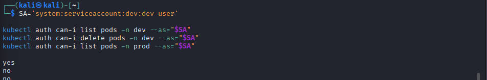

### RoleBinding Verification

```bash
kubectl get rolebinding dev-user-binding -n dev -o yaml
```

The YAML confirmed that `dev-user` in the `dev` namespace is bound to the `pod-reader` Role.

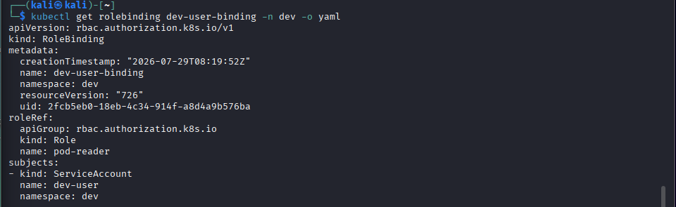

## Authentication and Authorization

Authentication identifies the Kubernetes service account as `system:serviceaccount:dev:dev-user`. Authorization then evaluates whether that identity can perform the requested action. The RoleBinding authorizes pod reading in `dev`, but authorization denies pod deletion and all equivalent requests in `prod`.

## Short-Answer Questions

### Q1. Why is attaching policies to groups better than attaching them directly to users?

Groups centralize permission management. A policy can be assigned once to a group, then users receive or lose the permission simply by being added to or removed from the group. This reduces duplication, configuration drift, and the chance of inconsistent user permissions.

### Q2. What is the difference between an IAM User and an IAM Role?

An IAM user is a persistent identity for a person or application and can have long-term credentials. An IAM role is an assumable identity that normally provides temporary credentials to a trusted principal, workload, or service.

### Q3. Explain least privilege using the Analyst account and how it reduces blast radius if compromised.

`Analyst_iman` has only the `AmazonS3ReadOnlyAccess` policy. A compromise would not grant administrator capabilities, so the attacker could not create users, modify policies, delete resources, or perform other privileged actions. Restricting permissions limits the impact of the incident.

### Q4. What is the difference between a Kubernetes Role and a RoleBinding?

A Role defines permitted actions on resources within a namespace. A RoleBinding assigns that Role to a user, group, or service account. The Role describes permissions; the RoleBinding grants them to an identity.

### Q5. Why did the service account fail to access prod, and which security principle does that demonstrate?

The service account failed because `pod-reader` and `dev-user-binding` exist only in the `dev` namespace. Their permissions do not apply to `prod`. This demonstrates least privilege and namespace-based isolation.

## Security Best-Practices Checklist

| Practice | Status |
| --- | --- |
| Do not use the root identity for daily administration | Applied through a separate administrator user |
| Assign administrator access through a group | Completed |
| Restrict analyst permissions to read-only access | Completed |
| Do not expose secret access keys in reports or repositories | Completed |
| Deactivate unused access keys | Completed |
| Separate development and production namespaces | Completed |
| Grant only required Kubernetes verbs and resources | Completed |
| Verify allow and deny decisions using `kubectl auth can-i` | Completed |

## Conclusion

This lab demonstrated cloud account security through identity separation, group-based administration, least-privilege policies, access-key hygiene, and namespace-scoped Kubernetes RBAC. The LocalStack IAM and kind Kubernetes environments were configured successfully, and the authorization tests confirmed that `dev-user` has only the required pod-read access in the `dev` namespace. The environment is ready for subsequent cloud security labs.
