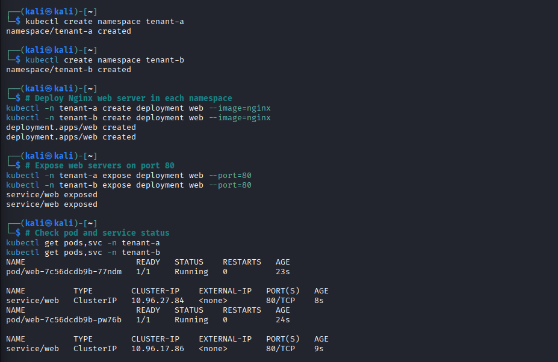
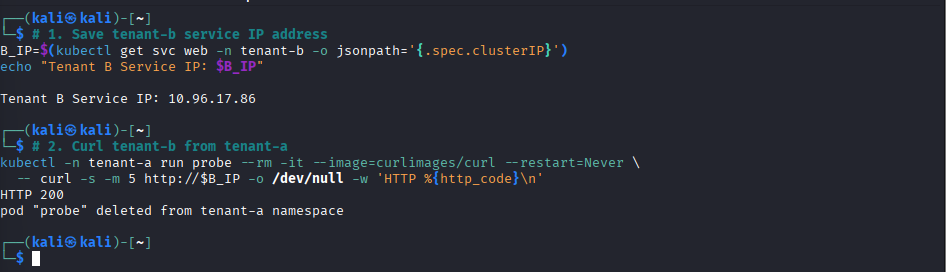
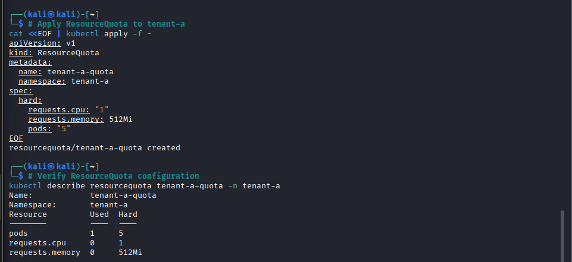
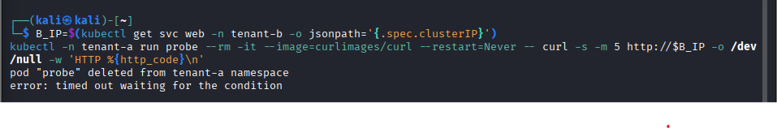
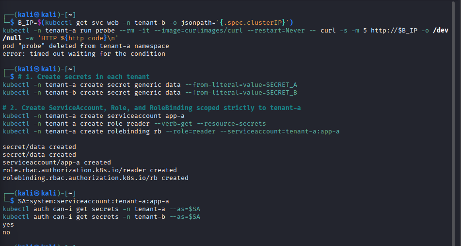
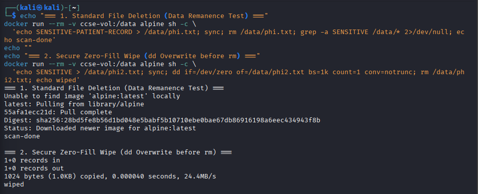

# Lab 2: Secure Isolation & Multi-Tenancy

**Course:** IKB42603 Cloud Computing Security Essentials  
**Student:** WAN MUHAMMAD NUR IMAN BIN WAN ISMAIL  
**Student ID:** 52215225039  

---

## Executive Summary

This report documents the completion of **Lab 2: Secure Isolation & Multi-Tenancy** (Compute, Network, and Storage Isolation using Docker & Kubernetes). In this lab, we model a multi-tenant cloud environment using Kubernetes namespaces, demonstrate default-open infrastructure risks, and implement security controls across three core isolation dimensions:
1. **Compute Isolation:** Process separation via Kubernetes namespaces and capacity containment using `ResourceQuota`.
2. **Network Isolation:** Network segmentation using Calico CNI and a default-deny ingress `NetworkPolicy`.
3. **Storage Isolation:** Logical storage separation via Kubernetes RBAC permission scoping and physical volume data remanence mitigation using cryptographic zero-fill overwrites (`dd`).

---

## Session A: Compute Isolation & Default-Open Risk

### Setup: Kubernetes Cluster with Calico Policy Enforcement

A Kubernetes cluster named `ccse-lab2` was initialized using `kind` with the default CNI disabled (`disableDefaultCNI: true`) to allow Project Calico to handle network routing and enforce `NetworkPolicy` rules.

```bash
cat <<EOF | kind create cluster --name ccse-lab2 --config=-
kind: Cluster
apiVersion: kind.x-k8s.io/v1alpha4
networking:
  disableDefaultCNI: true
  podSubnet: 192.168.0.0/16
EOF

kubectl apply -f https://raw.githubusercontent.com/projectcalico/calico/v3.27.0/manifests/calico.yaml
kubectl -n kube-system rollout status daemonset/calico-node --timeout=180s
```

Calico deployed successfully, and the `calico-node` DaemonSet reached operational status across the control plane node.

---

## Task 1: Two Tenants on One Cluster

To simulate a multi-tenant cloud environment, two distinct customers were created as separate Kubernetes namespaces: `tenant-a` and `tenant-b`. An Nginx web server deployment and ClusterIP service were provisioned within each tenant's namespace.

```bash
kubectl create namespace tenant-a
kubectl create namespace tenant-b

kubectl -n tenant-a create deployment web --image=nginx
kubectl -n tenant-b create deployment web --image=nginx

kubectl -n tenant-a expose deployment web --port=80
kubectl -n tenant-b expose deployment web --port=80

kubectl get pods,svc -n tenant-a
kubectl get pods,svc -n tenant-b
```

Both `tenant-a` and `tenant-b` deployments successfully transitioned to the `Running` state, each bound to an independent ClusterIP service on port 80.



---

## Task 2: Observe the Default-Open Risk

By default, Kubernetes implements an unsegmented flat network where pods in any namespace can reach pods in any other namespace. To prove this risk, an ephemeral `curl` probe pod was launched inside `tenant-a` targeting `tenant-b`'s internal ClusterIP service.

```bash
B_IP=$(kubectl get svc web -n tenant-b -o jsonpath='{.spec.clusterIP}')
echo "Tenant B Service IP: $B_IP"

kubectl -n tenant-a run probe --rm -it --image=curlimages/curl --restart=Never \
  -- curl -s -m 5 http://$B_IP -o /dev/null -w 'HTTP %{http_code}\n'
```

### Observation & Security Analysis
The probe returned `HTTP 200`, confirming that `tenant-a` successfully established an HTTP connection to `tenant-b`'s internal web server across namespace boundaries without authentication or authorization checks.



> **Risk Impact:** Logical separation (namespaces) alone does not prevent unauthorized cross-tenant lateral movement. An attacker compromising a container in one tenant namespace can freely explore and exploit unauthenticated microservices hosted by other tenants on the same shared cluster.

---

## Task 3: Contain the Noisy Neighbour (Resource Quotas)

To prevent resource exhaustion attacks or runaway processes from starving co-located tenants (Compute Isolation), a `ResourceQuota` object named `tenant-a-quota` was applied to `tenant-a`.

```bash
cat <<EOF | kubectl apply -f -
apiVersion: v1
kind: ResourceQuota
metadata:
  name: tenant-a-quota
  namespace: tenant-a
spec:
  hard:
    requests.cpu: "1"
    requests.memory: 512Mi
    pods: "5"
EOF

kubectl describe resourcequota tenant-a-quota -n tenant-a
```

The quota enforces strict hard limits on CPU (`1`), Memory (`512Mi`), and total Pod count (`5`) for `tenant-a`.



---

## Session B: Network & Storage Isolation

## Task 4: Default-Deny Network Isolation

To remediate the default-open risk observed in Task 2, a default-deny ingress `NetworkPolicy` was created for `tenant-b`. The policy matches all pods in `tenant-b` (`podSelector: {}`) and enables ingress filtering without specifying any permitted ingress rules.

```bash
cat <<EOF | kubectl apply -f -
apiVersion: networking.k8s.io/v1
kind: NetworkPolicy
metadata:
  name: default-deny-ingress
  namespace: tenant-b
spec:
  podSelector: {}
  policyTypes: [Ingress]
EOF

# Re-run the cross-tenant probe from tenant-a
kubectl -n tenant-a run probe --rm -it --image=curlimages/curl --restart=Never \
  -- curl -s -m 5 http://$B_IP -o /dev/null -w 'HTTP %{http_code}\n'
```

### Verification Result
When re-running the exact same probe from `tenant-a`, the connection timed out after 5 seconds (`curl: (28) Connection timed out`). The Calico CNI successfully dropped the unauthorized cross-tenant packets at the network layer.



---

## Task 5: Storage & Secret Isolation

To enforce storage and control-plane data isolation, secrets were created in both tenant namespaces. Kubernetes Role-Based Access Control (RBAC) was configured to grant a ServiceAccount in `tenant-a` (`app-a`) read access to secrets only within its own namespace.

```bash
# Create secrets in each tenant namespace
kubectl -n tenant-a create secret generic data --from-literal=value=SECRET_A
kubectl -n tenant-b create secret generic data --from-literal=value=SECRET_B

# Create scoped ServiceAccount, Role, and RoleBinding in tenant-a
kubectl -n tenant-a create serviceaccount app-a
kubectl -n tenant-a create role reader --verb=get --resource=secrets
kubectl -n tenant-a create rolebinding rb --role=reader --serviceaccount=tenant-a:app-a

SA=system:serviceaccount:tenant-a:app-a

# Test access authorization
kubectl auth can-i get secrets -n tenant-a --as=$SA
kubectl auth can-i get secrets -n tenant-b --as=$SA
```

### RBAC Authorization Test Results

```text
kubectl auth can-i get secrets -n tenant-a --as=$SA  =>  yes
kubectl auth can-i get secrets -n tenant-b --as=$SA  =>  no
```

- `app-a` was granted permission (`yes`) to read secrets inside `tenant-a`.
- `app-a` was denied access (`no`) when attempting to read secrets in `tenant-b`.



---

## Task 6: Data Remanence & Secure Deletion

Data remanence occurs when residual data remains on storage media after standard deletion operations. In this exercise, a shared Docker volume (`ccse-vol`) was used to compare standard deletion (`rm`) with secure block-level zero-wiping (`dd`).

```bash
# 1. Standard file creation and deletion (Data Remanence Test)
docker run --rm -v ccse-vol:/data alpine sh -c \
  'echo SENSITIVE-PATIENT-RECORD > /data/phi.txt; sync; rm /data/phi.txt; grep -a SENSITIVE /data/* 2>/dev/null; echo scan-done'

# 2. Secure block overwrite before deletion (Zero-Fill Wipe)
docker run --rm -v ccse-vol:/data alpine sh -c \
  'echo SENSITIVE > /data/phi2.txt; sync; dd if=/dev/zero of=/data/phi2.txt bs=1k count=1 conv=notrunc; rm /data/phi2.txt; echo wiped'
```

### Observations
1. **Standard Deletion (`rm`):** Unlinks filesystem metadata pointers, but raw string content (`SENSITIVE-PATIENT-RECORD`) remained readable in unallocated block space via direct binary scanning (`grep -a`).
2. **Secure Wipe (`dd`):** Overwrites file block contents with zeroes before unlinking, ensuring subsequent binary scans return no sensitive data.



---

## Short-Answer Deliverables

### Q1. Why can containers in different namespaces reach each other by default, and why is that dangerous in multi-tenant cloud?
**Answer:**  
Kubernetes namespaces provide logical scoping for API resources and object naming, but do **not** enforce network-layer isolation. Under the default Kubernetes networking model, all pods reside on a shared, unsegmented IP network where any container can communicate directly with any other pod across any namespace. In a multi-tenant cloud environment, this default-open policy exposes the cluster to severe multi-tenancy risks: an attacker who compromises a container in one tenant's namespace can perform lateral network movement, scan internal cluster services, and exploit unauthenticated microservices or APIs belonging to other tenants.

### Q2. Explain the default-deny principle and how your Network Policy implements it.
**Answer:**  
The **default-deny principle** (Zero Trust / Least Privilege) states that all network traffic paths must be blocked by default, permitting communication strictly through explicit whitelist rules ("deny by default, permit by exception"). In Task 4, our `NetworkPolicy` implements default-deny by specifying an empty `podSelector: {}` (selecting all pods in `tenant-b`) and specifying `policyTypes: [Ingress]` without declaring any allowed `ingress` rules. This instructs the Calico CNI to drop all incoming packets directed at `tenant-b` pods unless explicitly authorized by a matching rule.

### Q3. How do virtual machines and containers differ in isolation strength? When would you add a VM boundary?
**Answer:**  
Containers share the host operating system kernel and isolate processes using Linux kernel primitives (namespaces, cgroups, capabilities, seccomp filters). Consequently, a single kernel-level vulnerability or container escape flaw can compromise the host node and co-located workloads. Virtual Machines (VMs), in contrast, use a hypervisor to provide hardware-assisted virtualization, isolating guest operating systems with dedicated kernel instances, CPU states, and virtualized memory boundaries.  
**When to add a VM boundary:** A VM boundary (or microVM runtime such as gVisor or Kata Containers) should be added when hosting untrusted user code, running multi-tenant workloads with opposing compliance requirements (e.g., PCI-DSS vs public services), or whenever threat models dictate strong kernel separation beyond container Linux namespaces.

### Q4. What is data remanence, and why is cryptographic erasure the preferred cloud solution?
**Answer:**  
**Data Remanence** refers to the residual representation of sensitive data remaining on physical or virtual storage media after standard file deletion (`rm`), because standard deletion merely unlinks metadata pointers without overwriting raw underlying data blocks.  
**Why Cryptographic Erasure is Preferred in Cloud:** Cloud infrastructure relies on virtualized, pooled storage where tenants do not have direct physical hardware access or raw block-level overwrite permissions (`dd`, physical degaussing). Cryptographic erasure (crypto-shredding) solves this by encrypting stored data at rest with a unique encryption key. When data deletion is requested, the tenant permanently destroys the encryption key. Without the key, the residual storage blocks are rendered mathematically unrecoverable, satisfying cloud secure erasure standards without requiring physical disk access.

### Q5. Which of the three isolation dimensions (compute, network, storage) did each task exercise?
**Answer:**  
- **Task 1 & Task 3 — Compute Isolation:** Task 1 establishes logical process container separation via namespaces; Task 3 enforces capacity bounds using `ResourceQuota` (CPU, memory, pod limits) to contain noisy-neighbour resource starvation.
- **Task 2 & Task 4 — Network Isolation:** Task 2 demonstrates the default-open cross-tenant network path; Task 4 enforces network perimeter defense via a default-deny ingress `NetworkPolicy`.
- **Task 5 & Task 6 — Storage Isolation:** Task 5 enforces control-plane data isolation using Kubernetes RBAC Role/RoleBinding scoping for Secrets; Task 6 addresses volume storage isolation, residual data persistence, and secure block zero-overwriting.

---

## Security Best-Practices Checklist

| Security Control | Implementation Method | Verification Status |
| --- | --- | --- |
| Tenant Logical Separation | Isolated Kubernetes Namespaces (`tenant-a`, `tenant-b`) | Verified |
| Network Segmentation | Default-Deny Ingress `NetworkPolicy` via Calico CNI | Verified (HTTP 200 -> Timeout) |
| Compute Resource Protection | `ResourceQuota` for CPU (1 core), RAM (512Mi), Pods (5) | Verified via `describe resourcequota` |
| Secret & Storage RBAC | Namespace-scoped ServiceAccount, Role, and RoleBinding | Verified (`kubectl auth can-i`) |
| Storage Remanence Mitigation | Zero-fill block overwrite (`dd`) on container volume | Verified (residual scan vs wiped) |

---

## Verification Commands & Output Summary

```bash
# Verify active NetworkPolicies across all namespaces
kubectl get networkpolicy -A

# Verify ResourceQuota configuration in tenant-a
kubectl describe resourcequota tenant-a-quota -n tenant-a
```

---

## Cleanup & Teardown

```bash
# Delete the Lab 2 Kind cluster
kind delete cluster --name ccse-lab2

# Delete the demonstration Docker volume
docker volume rm ccse-vol
```

---

## Conclusion

Lab 2 successfully demonstrated the implementation of multi-tenancy and secure isolation across compute, network, and storage dimensions in Kubernetes and Docker. By combining logical namespace isolation, capacity limits via `ResourceQuota`, network ingress control via Calico `NetworkPolicy`, role-based secret scoping, and cryptographic/secure storage deletion principles, multi-tenant workloads can be safely isolated against cross-tenant attacks and noisy-neighbour capacity exhaustion.
