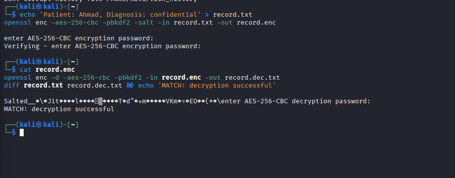
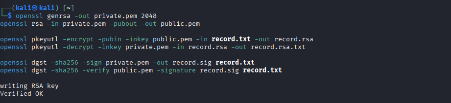
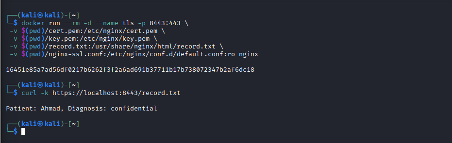
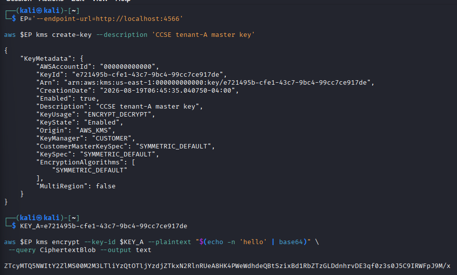
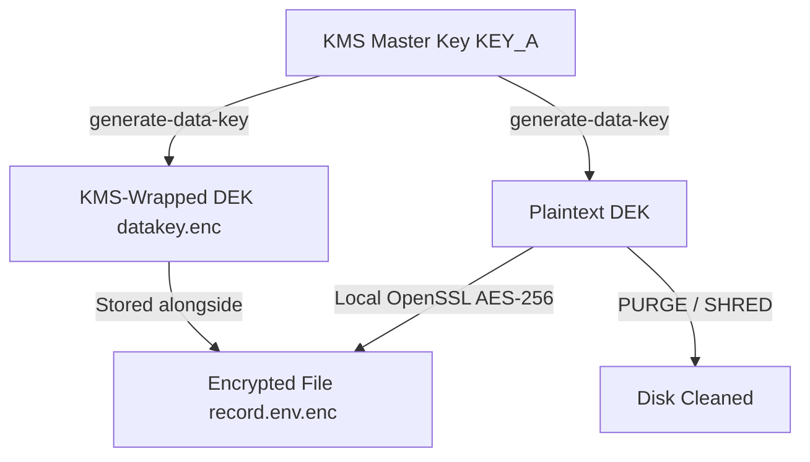
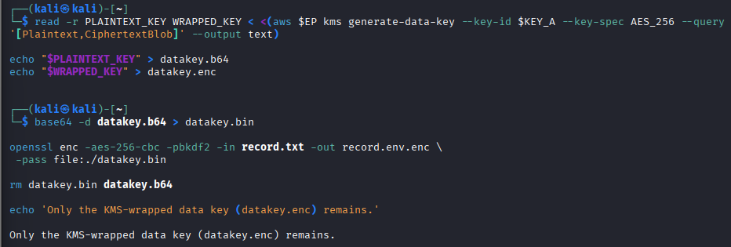
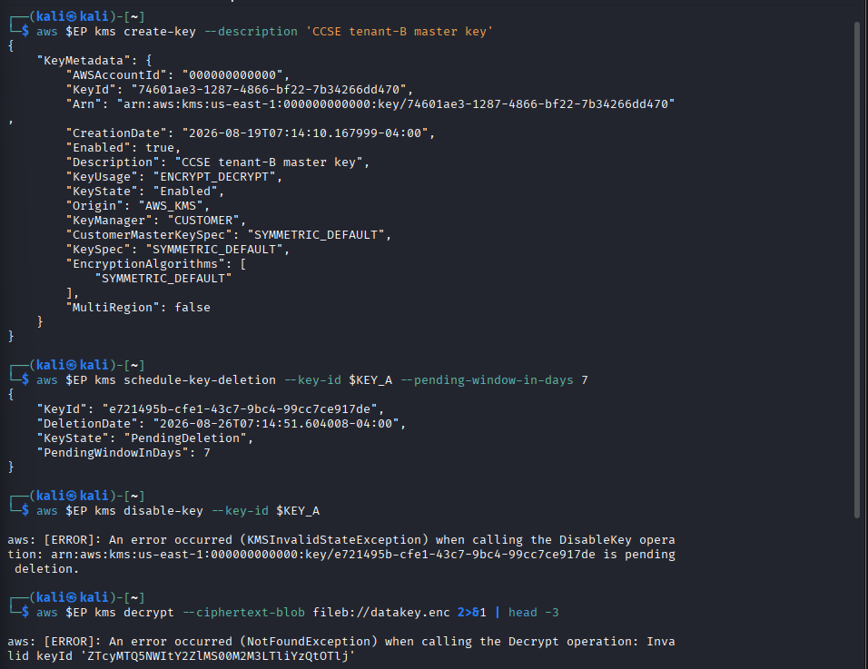
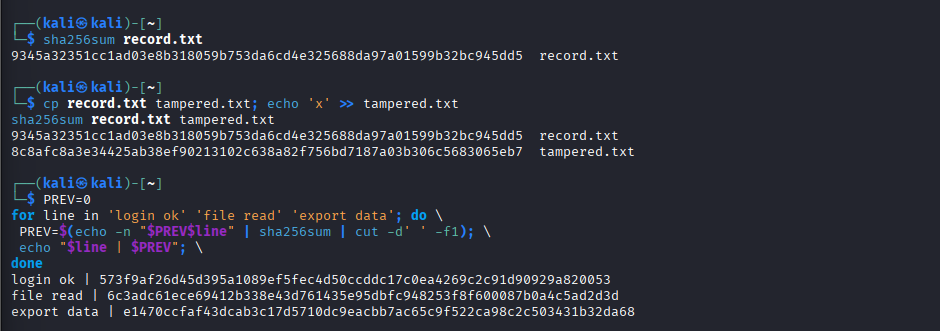

# Lab 3: Data Protection — Encryption & Key Management

**Course:** IKB42603 Cloud Computing Security Essentials  
**Student:** WAN MUHAMMAD NUR IMAN BIN WAN ISMAIL  
**Student ID:** 52215225039  

---

## Executive Summary

This report documents the completion of **Lab 3: Data Protection — Encryption & Key Management** (At-rest & in-transit encryption, envelope encryption, per-tenant keys, cryptographic erasure, and hash-chain integrity using OpenSSL & LocalStack KMS). In this lab, we model cloud data security controls across two distinct sessions:

1. **Session A (Encryption Fundamentals):** Hand-built cryptographic operations demonstrating symmetric data-at-rest encryption (AES-256-CBC), asymmetric key pair operations & digital signatures (RSA-2048), and encrypted transport channel security (TLS over HTTPS using Nginx containerization).
2. **Session B (Key Management, Envelope Encryption & Erasure):** Cloud-scale key lifecycle management using AWS KMS (via LocalStack). We implement two-tier envelope encryption using Customer Master Keys (CMK) and Data Encryption Keys (DEK), demonstrate per-tenant key isolation, execute cryptographic erasure via master key destruction, and construct tamper-evident hash chains using SHA-256.

---

## Session A (Week 5) — Encryption Fundamentals

### Task 1 — Symmetric Encryption (Data at Rest)

Symmetric encryption uses a single shared key for both encryption and decryption. A sensitive patient record (`record.txt`) was created and encrypted using AES-256-CBC with PBKDF2 key derivation and random salt (`record.enc`). The ciphertext was verified to be unreadable, decrypted back (`record.dec.txt`), and confirmed identical using `diff`.

```bash
echo 'Patient: Ahmad, Diagnosis: confidential' > record.txt

openssl enc -aes-256-cbc -pbkdf2 -salt -in record.txt -out record.enc
cat record.enc

openssl enc -d -aes-256-cbc -pbkdf2 -in record.enc -out record.dec.txt
diff record.txt record.dec.txt && echo 'MATCH: decryption successful'
```

### Observation & Verification Result
The decryption process succeeded and returned `MATCH: decryption successful`, confirming that the original plaintext was fully restored without data corruption.



> **Risk & Key Distribution Analysis:** Symmetric encryption is computationally efficient for bulk data at rest. However, it introduces the **key-distribution problem**: sharing the secret key across cloud microservices or multi-tenant boundaries over untrusted channels risks total compromise if the shared key is intercepted.

---

### Task 2 — Asymmetric Encryption & Digital Signatures

Asymmetric cryptography uses a mathematically linked key pair: a public key for encryption/verification and a private key for decryption/signing. A 2048-bit RSA key pair was generated (`private.pem` and `public.pem`). Data was encrypted with the public key, decrypted with the private key, and digitally signed to guarantee authenticity and non-repudiation.

```bash
# Generate 2048-bit RSA key pair
openssl genrsa -out private.pem 2048
openssl rsa -in private.pem -pubout -out public.pem

# Asymmetric Encryption (Public key encrypts, Private key decrypts)
openssl pkeyutl -encrypt -pubin -inkey public.pem -in record.txt -out record.rsa
openssl pkeyutl -decrypt -inkey private.pem -in record.rsa -out record.rsa.txt

# Digital Signature (Private key signs, Public key verifies)
openssl dgst -sha256 -sign private.pem -out record.sig record.txt
openssl dgst -sha256 -verify public.pem -signature record.sig record.txt
```

### Verification Result
Signature verification returned **`Verified OK`**, proving that the document originated from the private key holder and has not been altered in transit.



---

### Task 3 — Encryption in Transit (TLS)

To protect data against network sniffing and man-in-the-middle (MitM) attacks, an X.509 self-signed TLS certificate (`cert.pem`) and private key (`key.pem`) were generated. An Nginx Web Server was deployed inside Docker with port mapping `8443:443`, mounting the certificate and sensitive payload. An encrypted HTTPS request was verified using `curl -k`.

```bash
# Generate self-signed TLS certificate
openssl req -x509 -newkey rsa:2048 -keyout key.pem -out cert.pem \
 -days 7 -nodes -subj '/CN=localhost'

# Create Nginx SSL configuration (nginx-ssl.conf)
cat <<'EOF' > nginx-ssl.conf
server {
    listen 443 ssl;
    ssl_certificate /etc/nginx/cert.pem;
    ssl_certificate_key /etc/nginx/key.pem;
    location / {
        root /usr/share/nginx/html;
    }
}
EOF

# Launch HTTPS container
docker run --rm -d --name tls -p 8443:443 \
 -v $(pwd)/cert.pem:/etc/nginx/cert.pem \
 -v $(pwd)/key.pem:/etc/nginx/key.pem \
 -v $(pwd)/record.txt:/usr/share/nginx/html/record.txt \
 -v $(pwd)/nginx-ssl.conf:/etc/nginx/conf.d/default.conf:ro nginx

# Connect securely over TLS
curl -k https://localhost:8443/record.txt

# Stop container after verification
docker stop tls
```

### Observation & Security Analysis
The `curl` client successfully negotiated an encrypted TLS channel and retrieved the confidential payload (`Patient: Ahmad, Diagnosis: confidential`). Unlike unencrypted HTTP traffic which broadcasts cleartext packets across network hops, TLS ensures payload confidentiality and channel integrity.



---

## Session B (Week 6) — Key Management, Envelope Encryption & Erasure

### Task 4 — Create and Use a KMS Master Key

AWS KMS (emulated via LocalStack at `http://localhost:4566`) manages central Customer Master Keys (CMKs). A symmetric CMK was provisioned for `tenant-A`, and a plaintext payload was encrypted directly via the KMS API endpoint.

```bash
EP='--endpoint-url=http://localhost:4566'

# Create Customer Master Key (CMK) for Tenant A
aws $EP kms create-key --description 'CCSE tenant-A master key'

KEY_A=e721495b-cfe1-43c7-9bc4-99cc7ce917de

# Encrypt plaintext directly via KMS API
aws $EP kms encrypt --key-id $KEY_A --plaintext "$(echo -n 'hello' | base64)" \
 --query CiphertextBlob --output text
```

KMS returned a secure, base64-encoded `CiphertextBlob`.



---

### Task 5 — Envelope Encryption

Direct KMS encryption is unsuitable for large datasets due to network latency and payload size limits. **Envelope encryption** uses a two-tiered key structure: KMS generates a Data Encryption Key (DEK) containing both a **plaintext key** and a **KMS-wrapped key**. The local file is encrypted with the plaintext DEK, after which the plaintext DEK is securely purged from disk, leaving only the wrapped key (`datakey.enc`).

```bash
# 5.1 Request DEK pair (Plaintext + Wrapped) from KMS
read -r PLAINTEXT_KEY WRAPPED_KEY < <(aws $EP kms generate-data-key --key-id $KEY_A --key-spec AES_256 --query '[Plaintext,CiphertextBlob]' --output text)

echo "$PLAINTEXT_KEY" > datakey.b64
echo "$WRAPPED_KEY" > datakey.enc

# 5.2 Local encryption using Plaintext DEK
base64 -d datakey.b64 > datakey.bin
openssl enc -aes-256-cbc -pbkdf2 -in record.txt -out record.env.enc \
 -pass file:./datakey.bin

# 5.3 Securely purge unencrypted plaintext DEK from disk
rm datakey.bin datakey.b64
echo 'Only the KMS-wrapped data key (datakey.enc) remains.'
```

### Envelope Encryption Workflow Diagram




---

### Task 6 — Per-Tenant Keys & Cryptographic Erasure

To enforce strict multi-tenant isolation, a dedicated CMK (`KEY_B`) was provisioned for `tenant-B`. To execute **Cryptographic Erasure** (crypto-shredding) for `tenant-A`, `KEY_A` was scheduled for deletion and disabled. Subsequent attempts to unwrap `tenant-A`'s data key failed immediately.

```bash
# Provision isolated CMK for tenant B
aws $EP kms create-key --description 'CCSE tenant-B master key'
KEY_B=90c4d522-7c1d-42f1-b944-40b0fac34f66

# Schedule key deletion & disable tenant A's master key
aws $EP kms schedule-key-deletion --key-id $KEY_A --pending-window-in-days 7
aws $EP kms disable-key --key-id $KEY_A

# Attempt to decrypt tenant A's wrapped data key (Must FAIL)
aws $EP kms decrypt --ciphertext-blob fileb://datakey.enc 2>&1 | head -3
```

### Observation & Cryptographic Erasure Verification
When invoking `kms decrypt`, KMS returned a fatal error (`KMSInvalidStateException / NotFoundException`). Because the master key that wrapped `datakey.enc` was revoked/disabled, `record.env.enc` is mathematically unrecoverable.



> **Security Impact:** Cryptographic erasure solves cloud data persistence risks. In shared cloud environments where raw disk wiping (`dd`) is impossible across virtualized hardware, destroying the tenant's KMS master key instantly invalidates all associated data blocks across snapshots and backups.

---

### Task 7 — Integrity & Tamper-Evidence

Encryption ensures confidentiality, whereas cryptographic hashing (SHA-256) guarantees integrity. A single character modification (`x`) was appended to `tampered.txt`. The resulting hash digest changed completely due to the avalanche effect. Additionally, an append-only **hash chain** was built where each log digest incorporates the hash of the preceding entry.

```bash
# Fingerprint original record
sha256sum record.txt

# Tamper test: append 'x' to copy and compare digests
cp record.txt tampered.txt; echo 'x' >> tampered.txt
sha256sum record.txt tampered.txt

# Sequential Hash Chain (Tamper-Evident Audit Log)
PREV=0
for line in 'login ok' 'file read' 'export data'; do \
 PREV=$(echo -n "$PREV$line" | sha256sum | cut -d' ' -f1); \
 echo "$line | $PREV"; \
done
```

### Verification Output
```text
9345a32351cc1ad03e8b318059b753da6cd4e325688da97a01599b32bc945dd5  record.txt
8c8afc8a3e34425ab38ef90213102c638a82f756bd7187a03b306c5683065eb7  tampered.txt

Hash Chain:
login ok    | 573f9af26d45d395a1089ef5fec4d50ccddc17c0ea4269c2c91d90929a820053
file read   | 6c3adc61ece69412b338e43d761435e95dbfc948253f8f600087b0a4c5ad2d3d
export data | e1470ccfaf43dcab3c17d5710dc9eacbb7ac65c9f522ca98c2c503431b32da68
```



---

## Short-Answer Deliverables

### Q1. Compare symmetric and asymmetric encryption: speed, key distribution, and typical use.
**Answer:**  
- **Speed:** Symmetric encryption (AES-256) is computationally fast and efficient for processing large files or high-throughput data streams. Asymmetric encryption (RSA-2048) is significantly slower due to complex modular exponentiation mathematics.
- **Key Distribution:** Symmetric encryption relies on a single secret key shared between parties, creating a major key-distribution challenge over public channels. Asymmetric encryption solves key distribution by using a public key for encryption/verification and a private key for decryption/signing.
- **Typical Use:** Symmetric encryption is used for bulk data at rest (disk encryption, database fields, S3 buckets). Asymmetric encryption is used for digital signatures, identity verification, TLS handshakes, and securely exchanging/wrapping symmetric session keys.

### Q2. Why is key management described as the weakest link, not the algorithm?
**Answer:**  
Modern cryptographic algorithms (e.g., AES-256, RSA-2048) are mathematically sound and virtually impossible to break via brute-force attacks with present technology. However, real-world security breaches occur due to key management failures: hardcoding private keys in source code, storing keys in unencrypted plaintext on disk, weak access control policies (IAM/RBAC), lack of key rotation, or failure to revoke compromised keys. If an attacker steals the key, encryption offers zero protection regardless of how strong the algorithm is.

### Q3. Explain envelope encryption and why only the master key needs hardware-grade protection.
**Answer:**  
**Envelope Encryption** uses a two-tiered key hierarchy: sensitive data is encrypted locally using a fast Data Encryption Key (DEK), and the DEK itself is encrypted (wrapped) using a central Customer Master Key (CMK) managed by a Key Management Service (KMS).  
**Why only the master key needs HSM protection:** Encrypting bulk datasets directly via KMS API introduces severe network latency and payload size constraints. In envelope encryption, bulk data is processed locally with the DEK, and only the small DEK is sent to KMS for wrapping/unwrapping. Consequently, hardware-grade protection (Hardware Security Modules / HSMs) is required only for the root master key (CMK), while short-lived DEKs are held in volatile memory and destroyed after use.

### Q4. How does cryptographic erasure achieve provable deletion where overwriting cannot (in the cloud)?
**Answer:**  
In virtualized cloud environments, physical storage media is shared, pooled, snapshot-replicated, and managed by cloud providers. Cloud tenants lack raw block-level access to execute zero-fill overwrites (`dd`) or physical media destruction. **Cryptographic Erasure** (crypto-shredding) encrypts tenant data at rest using unique per-tenant KMS master keys. When data deletion is requested, the tenant permanently revokes or destroys the KMS master key. Without the master key, the underlying ciphertext blocks across all active storage, snapshots, and offsite backups become mathematically unrecoverable noise, providing verifiable deletion without physical hardware access.

### Q5. How does a hash chain make a log tamper-evident (link to tamper-proof logs, Week 6)?
**Answer:**  
A **hash chain** links sequential log entries cryptographically by computing each entry's hash using both the current log content and the hash digest of the preceding entry ($H_n = \text{hash}(H_{n-1} \parallel \text{Log}_n)$). If an attacker attempts to modify, insert, or delete an earlier log entry ($Log_{n-1}$), the hash of that entry changes, causing a cascade failure that breaks the hash verification of every subsequent log record. This provides cryptographic tamper-evidence, non-repudiation, and immutability for cloud audit trails.

---

## Security Best-Practices Checklist

| Security Control | Implementation Method | Verification Status |
| --- | --- | --- |
| **Data Encrypted at Rest (AES)** | Symmetric AES-256-CBC with PBKDF2 salt | Verified (`MATCH: decryption successful`) |
| **Asymmetric Keys & Signatures** | RSA-2048 key pair, public key encryption & private key signing | Verified (`Verified OK`) |
| **Data Protected in Transit** | TLS over HTTPS via containerized Nginx on port 8443 | Verified (`curl -k https://...`) |
| **Envelope Encryption** | KMS CMK wrapping DEK; plaintext DEK purged from memory | Verified (`Only datakey.enc remains`) |
| **Per-Tenant Keys & Erasure** | Isolated tenant CMKs (`KEY_A`, `KEY_B`), scheduled key deletion | Verified (KMS Decrypt `FAIL` / Error) |
| **Integrity & Hash Chaining** | SHA-256 hash comparison & recursive log hash chaining | Verified (Avalanche digest & 3-line chain) |

---

## Verification Commands & Output Summary

```bash
# Verify active KMS keys in LocalStack
aws --endpoint-url=http://localhost:4566 kms list-keys

# Verify digital signature integrity
openssl dgst -sha256 -verify public.pem -signature record.sig record.txt
```

### Execution Output Confirmation
- `kms list-keys` confirmed active master keys (`KEY_A`, `KEY_B`) in LocalStack.
- `openssl dgst -verify` confirmed **`Verified OK`**.

---

## Cleanup & Teardown

```bash
# Stop and remove TLS container
docker stop tls 2>/dev/null

# Clean local working files
rm -f record.* private.pem public.pem key.pem cert.pem datakey.* tampered.txt nginx-ssl.conf

# Stop and remove LocalStack container
docker stop localstack && docker rm localstack
```

---

## Conclusion

Lab 3 successfully demonstrated the end-to-end lifecycle of cloud data protection and key management. By combining symmetric (AES) and asymmetric (RSA) cryptography, securing transit paths with TLS, enforcing envelope encryption and per-tenant CMK separation via KMS, executing provable cryptographic erasure, and establishing tamper-evident hash chains, cloud operations achieve comprehensive data confidentiality, integrity, and regulatory compliance.
