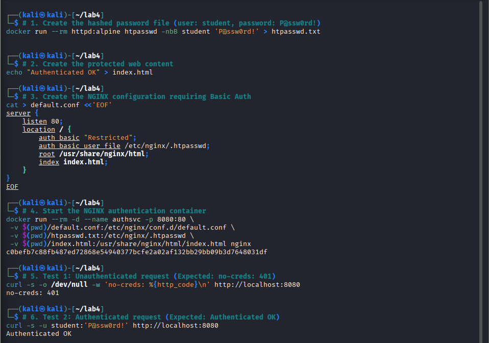
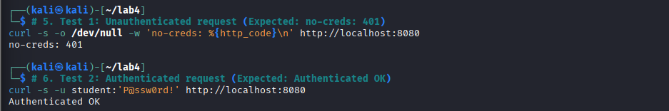
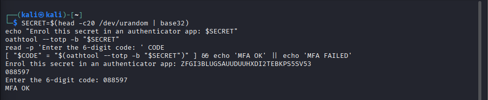
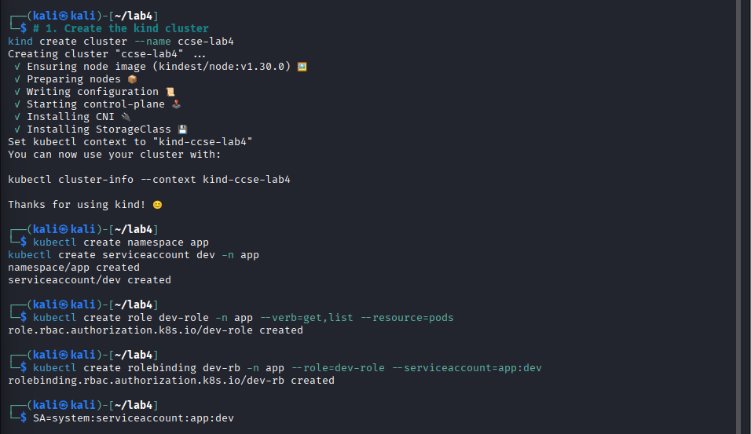
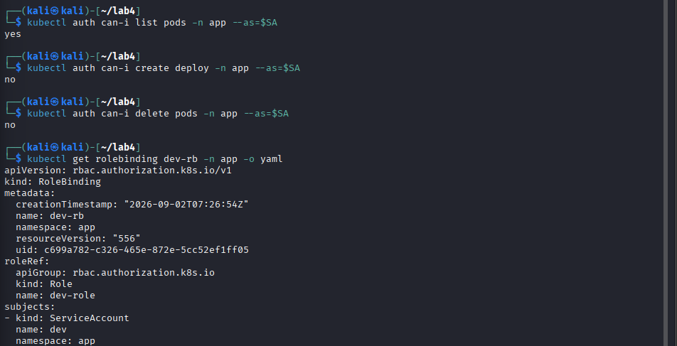
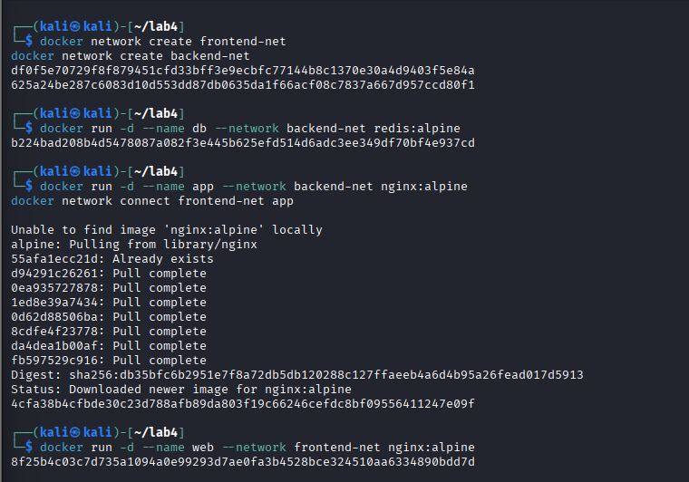
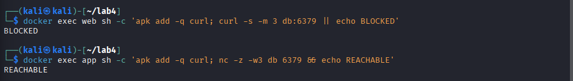
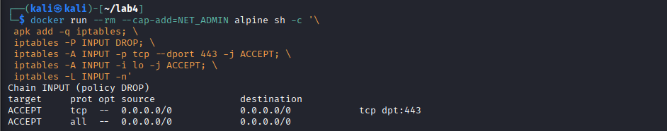
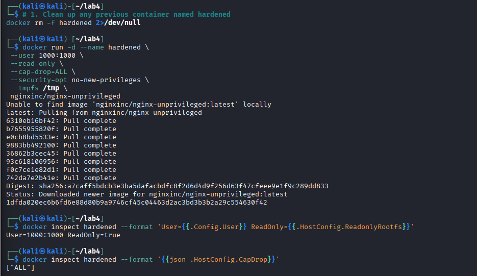
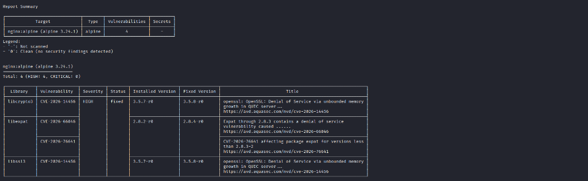

# Lab 4: Access Control & Network Security

**Course:** IKB42603 Cloud Computing Security Essentials  
**Student:** WAN MUHAMMAD NUR IMAN BIN WAN ISMAIL  
**Student ID:** 52215225039  

---

## Executive Summary

This report documents the successful completion of **Lab 4: Access Control & Network Security** (*AuthN vs AuthZ, network segmentation, firewall default-deny policies, container hardening, and vulnerability scanning using Docker & Kubernetes*). In this lab, we implement and verify core identity, access control, and defense-in-depth principles across two sessions:

1. **Session A (Authentication & Authorization):** Distinguishing identity verification from permission enforcement. We implement HTTP Basic Authentication (AuthN), enforce a second factor using Time-Based One-Time Passwords (TOTP / MFA RFC 6238), and apply fine-grained Role-Based Access Control (RBAC) in Kubernetes using `kind` and `kubectl` to enforce the Principle of Least Privilege.
2. **Session B (Network Security & Hardening):** Implementing network and host-level defense in depth. We construct an isolated three-tier segmented Docker network architecture, enforce a default-deny firewall model using `iptables` (mirroring Cloud Security Groups), apply five-layer runtime container hardening (non-root, read-only rootfs, dropped capabilities, no-new-privileges, tmpfs), and conduct container vulnerability scanning using Aquasec Trivy.

---

## Lab Learning Outcomes

1. Distinguish and implement **authentication** (who you are) and **authorization** (what you may do).
2. Add a second factor with a **TOTP (MFA)** code and verify it.
3. Configure **network access control and segmentation** so services reach only what they must.
4. **Harden a container image**: non-root user, minimal base, dropped Linux capabilities, and read-only filesystem.
5. Scan an image for vulnerabilities with **Trivy** and apply the principle of least privilege across compute, network, and storage.

---

## Environment & Prerequisites

* **Operating System:** Kali Linux 2026 / Linux 6.12
* **Container Engine:** Docker Engine 28.5.2
* **Kubernetes Orchestration:** `kind` v0.23.0 & `kubectl` v1.36.3
* **Authentication Tools:** `httpd:alpine` (`htpasswd` with bcrypt), `oathtool`
* **Vulnerability Scanner:** `aquasec/trivy` container scanner

---

# Session A (Week 7) — Authentication & Authorization

### Task 1 — Authentication: a Password-Protected Service

**Objective:** Demonstrate Authentication (AuthN) by deploying an NGINX web service protected by HTTP Basic Authentication. Unauthenticated requests must be rejected with HTTP 401 Unauthorized, while valid credentials (`student:P@ssw0rd!`) must succeed with HTTP 200 OK.

#### Implementation Commands:
```bash
# 1. Create a password file with bcrypt hashing (user: student, password: P@ssw0rd!)
docker run --rm httpd:alpine htpasswd -nbB student 'P@ssw0rd!' > htpasswd.txt

# 2. Serve a protected web page requiring authentication
echo "Authenticated OK" > index.html

cat > default.conf <<'EOF'
server {
    listen 80;
    location / {
        auth_basic "Restricted";
        auth_basic_user_file /etc/nginx/.htpasswd;
        root /usr/share/nginx/html;
        index index.html;
    }
}
EOF

# 3. Launch the authentication container
docker run --rm -d --name authsvc -p 8080:80 \
 -v $(pwd)/default.conf:/etc/nginx/conf.d/default.conf \
 -v $(pwd)/htpasswd.txt:/etc/nginx/.htpasswd \
 -v $(pwd)/index.html:/usr/share/nginx/html/index.html nginx

# 4. Test unauthenticated request (Should return HTTP 401)
curl -s -o /dev/null -w 'no-creds: %{http_code}\n' http://localhost:8080

# 5. Test authenticated request with valid credentials (Should return HTTP 200)
curl -s -u student:'P@ssw0rd!' http://localhost:8080
```

#### Observation & Evidence:
* **Unauthenticated Request:** Returned `no-creds: 401`. NGINX rejected the request in the Access Phase because the `Authorization` header was missing.
* **Authenticated Request:** Returned `Authenticated OK` (HTTP 200). NGINX validated the bcrypt hash and granted access to the protected payload.





> **Security Analysis & Request Processing Phases:** In NGINX, access authentication occurs during the `NGX_HTTP_ACCESS_PHASE`. Serving static content through the `NGX_HTTP_CONTENT_PHASE` ensures that credential validation strictly precedes content delivery. Authentication addresses the foundational question: *Are you who you claim to be?*

---

### Task 2 — Multi-Factor Authentication (MFA / TOTP)

**Objective:** Enhance authentication security by adding a Time-Based One-Time Password (TOTP) factor conforming to RFC 6238.

#### Implementation Commands:
```bash
# 1. Generate a 20-byte base32 shared secret from kernel entropy pool
SECRET=$(head -c20 /dev/urandom | base32)
echo "Enrol this secret in an authenticator app: $SECRET"

# 2. Calculate current 6-digit TOTP code
oathtool --totp -b "$SECRET"

# 3. Prompt user input and validate token against server calculation
read -p 'Enter the 6-digit code: ' CODE
[ "$CODE" = "$(oathtool --totp -b "$SECRET")" ] && echo 'MFA OK' || echo 'MFA FAILED'
```

#### Observation & Evidence:
* **Generated Secret:** `ZFGI3BLGSAUUDUUHXDI2TEBKPS5SV53`
* **Generated TOTP Code:** `088597`
* **Validation Result:** **`MFA OK`**



> **Security Analysis:** Single-factor password authentication is vulnerable to credential stuffing, password reuse, brute-force, and phishing attacks. TOTP introduces a second authentication factor: *Something you have* (the authenticator token generator) combined with *Something you know* (the password). Because TOTP hashes the shared secret with the current 30-second Unix time window ($T = \lfloor \text{UnixTime} / 30 \rfloor$), intercepted codes expire rapidly, mitigating credential replay attacks.

---

### Task 3 — Authorization: RBAC Roles (Kubernetes)

**Objective:** Implement fine-grained Role-Based Access Control (RBAC) in Kubernetes. Create an isolated namespace `app`, a ServiceAccount `dev`, and a Role `dev-role` permitting only read actions (`get`, `list`) on `pods`. Verify that unauthorized operations (`create deploy`, `delete pods`) are denied.

#### Implementation Commands:
```bash
# 1. Create dedicated kind cluster
kind create cluster --name ccse-lab4

# 2. Create namespace and service account
kubectl create namespace app
kubectl create serviceaccount dev -n app

# 3. Create scoped Role permitting only read-only pod access
kubectl create role dev-role -n app --verb=get,list --resource=pods

# 4. Bind the role to the dev service account
kubectl create rolebinding dev-rb -n app --role=dev-role --serviceaccount=app:dev

# 5. Authorize and verify permissions
SA=system:serviceaccount:app:dev
kubectl auth can-i list pods -n app --as=$SA       # Expected: yes
kubectl auth can-i create deploy -n app --as=$SA    # Expected: no
kubectl auth can-i delete pods -n app --as=$SA      # Expected: no

# 6. Verification manifest output
kubectl get rolebinding dev-rb -n app -o yaml
```

#### Observation & Evidence:
* `kubectl auth can-i list pods`: **`yes`** (Permitted by `dev-role`)
* `kubectl auth can-i create deploy`: **`no`** (Blocked by default-deny RBAC)
* `kubectl auth can-i delete pods`: **`no`** (Blocked by default-deny RBAC)





> **Security Analysis:** While Authentication answers *"Who are you?"*, Authorization enforces *"What are you allowed to do?"*. Kubernetes RBAC defaults to explicit deny: any API action not explicitly enumerated in a bound Role is rejected. This enforces the Principle of Least Privilege and stops lateral privilege escalation by service accounts.

---

# Session B (Week 8) — Network Security & Hardening

### Task 4 — Network Segmentation (Three-Tier Architecture)

**Objective:** Implement network segmentation across a classic three-tier architecture (`web` $\rightarrow$ `app` $\rightarrow$ `db`). Isolate the data tier so that the public-facing `web` tier cannot directly access the `db`, while the `app` tier can communicate with both tiers.

```text
[ WEB (nginx) ]
       │
   (frontend-net)
       │
[ APP (nginx) ] (Dual-Homed Middleware)
       │
   (backend-net)
       │
[ DB (redis)  ]
```

#### Implementation Commands:
```bash
# 1. Create two isolated bridge networks
docker network create frontend-net
docker network create backend-net

# 2. Deploy database tier on backend-net only
docker run -d --name db --network backend-net redis:alpine

# 3. Deploy application tier on backend-net and attach to frontend-net
docker run -d --name app --network backend-net nginx:alpine
docker network connect frontend-net app

# 4. Deploy web tier on frontend-net only
docker run -d --name web --network frontend-net nginx:alpine

# 5. Test Web -> DB connection (Expected: BLOCKED)
docker exec web sh -c 'apk add -q curl; curl -s -m 3 db:6379 || echo BLOCKED'

# 6. Test App -> DB connection (Expected: REACHABLE)
docker exec app sh -c 'apk add -q curl; nc -z -w3 db 6379 && echo REACHABLE'
```

#### Observation & Evidence:
* **Web $\rightarrow$ DB:** Returned **`BLOCKED`**. `web` lacks network routing and DNS resolution to `backend-net`.
* **App $\rightarrow$ DB:** Returned **`REACHABLE`**. `app` is dual-homed and communicates over Redis port `6379`.





> **Security Analysis:** Network segmentation provides defense in depth. If an attacker breaches the internet-exposed web container through an application vulnerability (e.g., remote code execution), network segmentation prevents direct access to backend databases, strictly containing lateral movement.

---

### Task 5 — Firewall Rules (Default-Deny)

**Objective:** Enforce host-level packet filtering using `iptables` under a **Default-Deny** security posture, mirroring Cloud Security Groups and Network Access Control Lists (NACLs).

#### Implementation Commands:
```bash
docker run --rm --cap-add=NET_ADMIN alpine sh -c '\
 apk add -q iptables; \
 iptables -P INPUT DROP; \
 iptables -A INPUT -p tcp --dport 443 -j ACCEPT; \
 iptables -A INPUT -i lo -j ACCEPT; \
 iptables -L INPUT -n'
```

#### Observation & Evidence:
* Default Policy: `INPUT (policy DROP)`
* Inbound TCP port `443` (HTTPS): `ACCEPT`
* Loopback interface (`lo`): `ACCEPT`

```text
Chain INPUT (policy DROP)
target     prot opt source               destination         
ACCEPT     tcp  --  0.0.0.0/0            0.0.0.0/0            tcp dpt:443
ACCEPT     all  --  0.0.0.0/0            0.0.0.0/0           
```



> **Security Analysis:** Default-Deny is the cornerstone of network hardening. By dropping all inbound packets by default and explicitly allowing only essential ports (TCP 443 for HTTPS and local loopback for inter-process communication), unauthorized probing, unsolicited connection attempts, and exposed background management ports are unconditionally dropped.

---

### Task 6 — Container Hardening & Vulnerability Scanning

**Objective:** Reduce container attack surface by enforcing five distinct host/runtime isolation controls and scanning container base images for known vulnerabilities using Aquasec Trivy.

#### Implementation Commands:
```bash
# 1. Run unprivileged NGINX with comprehensive hardening flags
docker run -d --name hardened \
 --user 1000:1000 \
 --read-only \
 --cap-drop=ALL \
 --security-opt no-new-privileges \
 --tmpfs /tmp \
 nginxinc/nginx-unprivileged

# 2. Inspect user and filesystem immutability
docker inspect hardened --format 'User={{.Config.User}} ReadOnly={{.HostConfig.ReadonlyRootfs}}'

# 3. Inspect dropped Linux capabilities
docker inspect hardened --format '{{json .HostConfig.CapDrop}}'

# 4. Scan image for HIGH and CRITICAL vulnerabilities using Trivy
docker run --rm aquasec/trivy image --severity HIGH,CRITICAL nginx:alpine
```

#### Observation & Evidence:
* **User:** `1000:1000` (Non-root)
* **Read-Only Root Filesystem:** `ReadOnly=true`
* **Dropped Capabilities:** `["ALL"]`
* **Trivy Vulnerability Scan:** Identified 4 HIGH severity vulnerabilities in `nginx:alpine` (`libcrypto3`, `libexpat`, `libssl3` — including `CVE-2026-14456`, `CVE-2026-66846`, `CVE-2026-76641`).





> **Security Analysis:** Container hardening dramatically restricts what an adversary can accomplish after code execution. Running as non-root stops root-level kernel exploits; read-only rootfs prevents binary tampering and web shell installation; dropping all capabilities neutralizes raw packet sniffing and administrative system calls; and `no-new-privileges` blocks SUID binary abuse.

---

## Required Verification Commands Summary

```bash
# 1. Kubernetes RoleBinding Verification
kubectl get rolebinding dev-rb -n app -o yaml

# 2. Container Hardened Capabilities Verification
docker inspect hardened --format '{{json .HostConfig.CapDrop}}'
```

### Manifest & Output Evidence:
```yaml
apiVersion: rbac.authorization.k8s.io/v1
kind: RoleBinding
metadata:
  creationTimestamp: "2026-09-02T07:26:54Z"
  name: dev-rb
  namespace: app
  resourceVersion: "556"
  uid: c699a782-c326-465e-872e-5cc52ef1ff05
roleRef:
  apiGroup: rbac.authorization.k8s.io
  kind: Role
  name: dev-role
subjects:
- kind: ServiceAccount
  name: dev
  namespace: app
```
```json
["ALL"]
```

---

## Security Best-Practices Checklist

| Security Control | Implementation Method | Lab Verification Result | Status |
| :--- | :--- | :--- | :---: |
| **Service Authentication** | HTTP Basic Auth with bcrypt hashing (`htpasswd`) | Unauthenticated rejected (`401`); Valid accepted (`200 Authenticated OK`) | **VERIFIED** |
| **Multi-Factor Authentication** | TOTP RFC 6238 with base32 secret & `oathtool` | Code verified within 30s window (`MFA OK`) | **VERIFIED** |
| **RBAC Authorization** | Kubernetes Role & RoleBinding (`dev-role` / `dev-rb`) | List pods (`yes`); Create deploy (`no`); Delete pods (`no`) | **VERIFIED** |
| **Network Segmentation** | Three-tier Docker subnets (`frontend-net`, `backend-net`) | Web $\rightarrow$ DB (`BLOCKED`); App $\rightarrow$ DB (`REACHABLE`) | **VERIFIED** |
| **Default-Deny Firewall** | `iptables -P INPUT DROP` with explicit port 443 allow | Inbound dropped by default; HTTPS & loopback accepted | **VERIFIED** |
| **Container Hardening** | Non-root, read-only rootfs, `cap-drop=ALL`, `no-new-privileges` | `User=1000:1000`, `ReadOnly=true`, `CapDrop=["ALL"]` | **VERIFIED** |
| **Vulnerability Management** | Aquasec Trivy container image scan | Detected 4 HIGH CVEs (`libcrypto3`, `libexpat`, `libssl3`) | **VERIFIED** |

---

## Short-Answer Deliverables

### Q1. Explain the difference between authentication and authorization using Tasks 1 and 3.
**Answer:**  
- **Concept:** Authentication (AuthN) verifies identity (*"Who are you?"*), whereas Authorization (AuthZ) governs access permissions (*"What are you permitted to do?"*).
- **Lab Evidence:** In **Task 1**, HTTP Basic Authentication evaluated requester identity: requests without credentials failed with `no-creds: 401`, while requests with valid credentials (`student:P@ssw0rd!`) were granted entry with `200 Authenticated OK`. In **Task 3**, the identity was already established as the authenticated service account `system:serviceaccount:app:dev`. When querying permissions, Kubernetes RBAC evaluated `dev-role` and granted permission to list pods (`yes`), but strictly denied creating deployments (`no`) and deleting pods (`no`).
- **Security Impact & Real-World Connection:** In modern cloud computing and Zero Trust architectures, successful identity verification does not imply broad system access. Authentication grants entry, but authorization strictly limits the blast radius of that identity according to the Principle of Least Privilege.

---

### Q2. Why is MFA so effective, and which attacks does it defeat?
**Answer:**  
- **Concept:** Multi-Factor Authentication (MFA) requires presenting two or more independent authentication factors across different categories: *Something you know* (passwords/PINs), *Something you have* (hardware token, TOTP authenticator app, smart card), or *Something you are* (biometrics).
- **Lab Evidence:** In **Task 2**, the TOTP algorithm generated a dynamic 6-digit code derived from a high-entropy secret (`ZFGI3BLGSAUUDUUHXDI2TEBKPS5SV53`) and the current 30-second Unix time window, outputting `MFA OK` upon validation.
- **Attacks Defeated:** MFA effectively neutralizes credential stuffing, password reuse attacks, dictionary attacks, brute-force guessing, and passive credential sniffing. Even if an adversary intercepts or purchases a user's static password, authentication fails without the physical or cryptographic second factor.
- **Real-World Connection:** Enterprise cloud identity providers (AWS IAM, Microsoft Entra ID, Google Cloud IAM) mandate MFA for privileged accounts because it mitigates over 99% of automated credential-based attacks.

---

### Q3. How does network segmentation limit the damage of a compromised web server?
**Answer:**  
- **Concept:** Network segmentation partitions a computer network into distinct subnets and security zones to restrict lateral movement between tiers.
- **Lab Evidence:** In **Task 4**, the web server resided solely on `frontend-net`, while the database container resided exclusively on `backend-net`. Probing the database from the web container returned **`BLOCKED`**, whereas the application middleware container (dual-homed on both networks) returned **`REACHABLE`**.
- **Security Impact & Real-World Connection:** Public-facing web tiers have the highest threat exposure. If an attacker exploits a vulnerability in the web tier (such as an NGINX zero-day, SSRF, or SQL injection), network segmentation prevents direct TCP/IP connections from the web server to the internal database. The attacker cannot exfiltrate raw database records or compromise backend storage without pivoting through hardened middleware controls.

---

### Q4. What does a default-deny firewall policy achieve, and how does it relate to cloud security groups?
**Answer:**  
- **Concept:** A **default-deny** policy sets the base firewall posture to unconditionally drop or reject all incoming traffic unless an explicit rule allows it.
- **Lab Evidence:** In **Task 5**, `iptables -P INPUT DROP` established the baseline drop policy, followed by explicit allow rules for TCP port 443 and the loopback interface (`lo`).
- **Relation to Cloud Security Groups:** Cloud Virtual Private Cloud (VPC) Security Groups (e.g., AWS Security Groups, Azure Network Security Groups, GCP Firewall Rules) operate on an implicit default-deny architecture. Inbound traffic is completely blocked by default; cloud engineers must explicitly define ingress rules specifying protocol, port range, and authorized CIDR blocks. This minimizes the attack surface by ensuring that unmanaged, forgotten, or exposed internal ports are never reachable from untrusted networks.

---

### Q5. List the hardening measures you applied and the attack surface each one removes.
**Answer:**  
In **Task 6**, five distinct hardening controls were applied to the container runtime:

1. **Non-Root Execution (`--user 1000:1000`):**
   * *Attack Surface Removed:* Prevents container breakout processes from possessing UID 0 (root) privileges on the host Linux kernel. If the application is compromised, the attacker cannot execute root-level modifications.
2. **Read-Only Root Filesystem (`--read-only`):**
   * *Attack Surface Removed:* Eliminates runtime filesystem modification. Attackers cannot download malware, compile exploits, inject malicious shared libraries (`.so`), or overwrite system binaries.
3. **Dropped Linux Capabilities (`--cap-drop=ALL`):**
   * *Attack Surface Removed:* Strips all default POSIX capabilities (such as `CAP_NET_RAW`, `CAP_SYS_ADMIN`, `CAP_CHOWN`). This removes the ability to perform raw packet sniffing, network spoofing, or device mounting.
4. **No New Privileges (`--security-opt no-new-privileges`):**
   * *Attack Surface Removed:* Disallows processes from gaining elevated privileges via `setuid` or `setgid` binaries (e.g., `sudo`, `su`), preventing privilege escalation within the container.
5. **In-Memory Temporary Storage (`--tmpfs /tmp`):**
   * *Attack Surface Removed:* Restricts temporary file creation to volatile RAM (`tmpfs`), ensuring no persistent attacker artifacts remain on physical disk storage.
6. **Vulnerability Scanning (`aquasec/trivy`):**
   * *Attack Surface Removed:* Scans base image packages for known CVEs (e.g., High-severity OpenSSL and Expat vulnerabilities), allowing developers to patch vulnerable packages before deploying to production.

---

## Cleanup & Teardown

To cleanly restore the Kali Linux environment after lab completion, run the teardown commands from Page 6 of the lab manual:

```bash
# 1. Stop and remove all lab containers
docker rm -f authsvc db app web hardened 2>/dev/null

# 2. Remove segmented Docker networks
docker network rm frontend-net backend-net 2>/dev/null

# 3. Delete the Kubernetes kind cluster
kind delete cluster --name ccse-lab4

# 4. Clean local working directory files
rm -f htpasswd.txt default.conf index.html
```

---

## Conclusion

Lab 4 provided hands-on validation of critical cloud access control and network security architectures. By combining **HTTP Basic Authentication** and **TOTP MFA** for strong identity assurance, enforcing **Kubernetes RBAC** for least-privilege authorization, establishing **three-tier network segmentation**, implementing **default-deny firewall policies**, applying **defense-in-depth container hardening**, and scanning images with **Trivy**, we constructed a resilient, multi-layered cloud computing security perimeter that safeguards workload integrity and contains potential threats at every tier.
