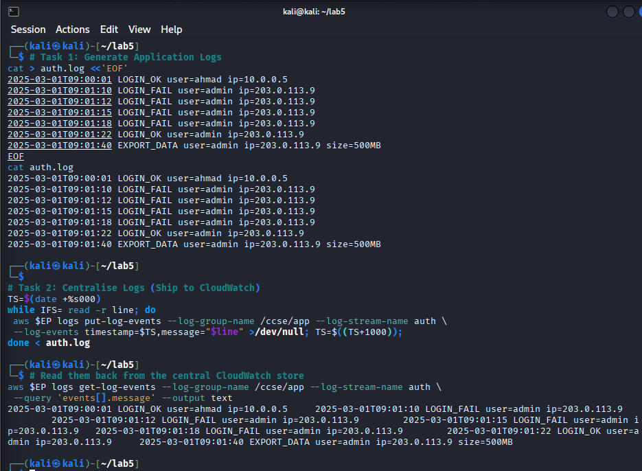
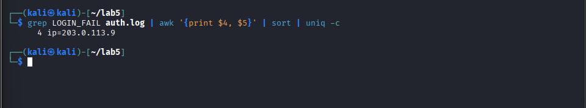
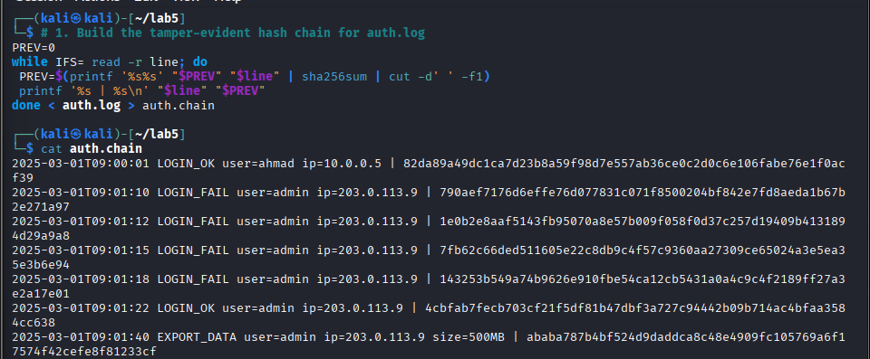
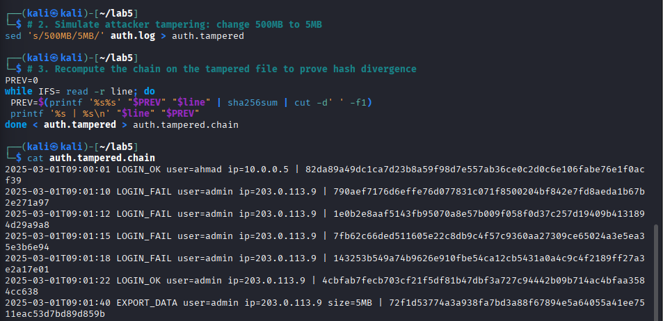
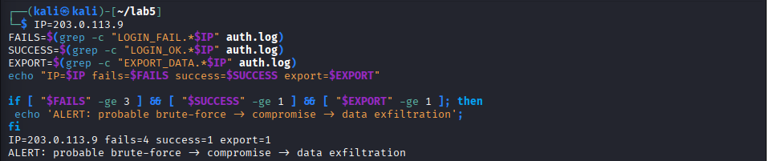
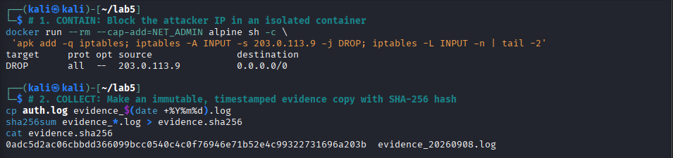
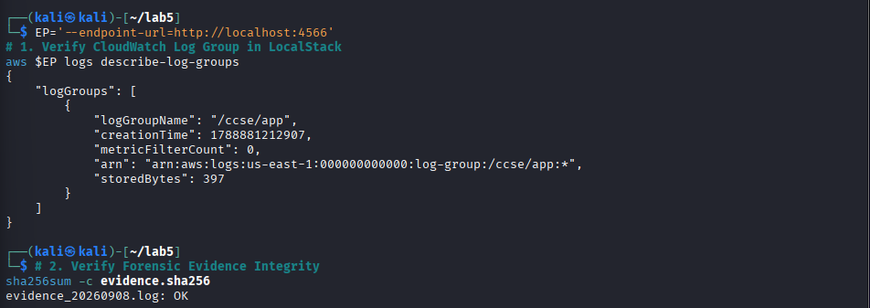

# Lab 5: Monitoring, Logging & Incident Detection

**Course:** IKB42603 Cloud Computing Security Essentials  
**Student:** WAN MUHAMMAD NUR IMAN BIN WAN ISMAIL  
**Student ID:** 52215225039  

---

## Executive Summary

This report documents the successful completion of **Lab 5: Monitoring, Logging & Incident Detection** (*Centralised logging, tamper-proof logs, threat detection, multi-event correlation, and incident response lifecycle using Docker & LocalStack AWS CloudWatch Logs*). In this lab, we build complete visibility and operational security mechanisms across two distinct sessions:

1. **Session A (Logging & Centralisation):** Establishing cloud telemetry visibility. We simulate real-world authentication telemetry (`auth.log`), stream events into a centralized AWS CloudWatch Log Group (`/ccse/app`) and Stream (`auth`) via LocalStack, read back the ingested stream to confirm durability, and query the log store to identify security anomalies (brute-force failures by IP).
2. **Session B (Tamper-Proofing, Detection & Response):** Turning visibility into proactive threat detection and incident response. We construct a tamper-evident SHA-256 cryptographic hash chain (`auth.chain`) to detect unauthorized log alterations, implement a multi-event SIEM correlation engine that detects complex intrusion patterns (Brute Force $\rightarrow$ Compromise $\rightarrow$ Data Exfiltration), execute rapid host-level containment via `iptables`, and generate cryptographically verified forensic evidence with a formal Incident Response Report.

---

## Lab Learning Outcomes

1. Collect and centralise logs from multiple services (**cloud telemetry**).
2. Distinguish **logs** (durable historical records) from **events** (real-time alerts/triggers) and query logs for security-relevant activity.
3. Build a **tamper-evident (hash-chained)** audit log and detect unauthorized alteration.
4. Detect an incident by **correlating multiple events** across time and sources.
5. Execute the **incident-response lifecycle**: detect, contain, collect evidence, and document an incident timeline.

---

## Environment & Prerequisites

* **Operating System:** Kali Linux 2026 / Linux 6.12
* **Container Runtime:** Docker Engine 28.5.2
* **Cloud Telemetry Emulator:** LocalStack Community Edition 3.4 (`localstack/localstack:3.4`)
* **Cloud Management Client:** AWS CLI v2 (`aws logs`)
* **Forensic & Cryptographic Tools:** `sha256sum`, `awk`, `sed`, `grep`, `iptables`

---

# Session A (Week 9) — Logging & Centralisation

### Setup — LocalStack & CloudWatch Logs Initialization

Before generating telemetry, LocalStack was deployed to provide local AWS CloudWatch Logs services. A dedicated CloudWatch Log Group `/ccse/app` and Log Stream `auth` were created to serve as the centralized logging repository.

```bash
# 1. Start LocalStack Community container
docker run -d --name localstack -p 4566:4566 localstack/localstack:3.4

# 2. Configure AWS CLI environment & endpoint
export AWS_ACCESS_KEY_ID=test
export AWS_SECRET_ACCESS_KEY=test
export AWS_DEFAULT_REGION=us-east-1
EP='--endpoint-url=http://localhost:4566'

# 3. Create central CloudWatch log group and log stream
aws $EP logs create-log-group --log-group-name /ccse/app
aws $EP logs create-log-stream --log-group-name /ccse/app --log-stream-name auth
```

---

### Task 1 — Generate Application Logs

**Objective:** Create a structured authentication log file (`auth.log`) representing realistic production telemetry, containing baseline legitimate user activity alongside an attacker's brute-force sequence and subsequent high-volume data exfiltration.

#### Implementation Commands:
```bash
cat > auth.log <<'EOF'
2025-03-01T09:00:01 LOGIN_OK user=ahmad ip=10.0.0.5
2025-03-01T09:01:10 LOGIN_FAIL user=admin ip=203.0.113.9
2025-03-01T09:01:12 LOGIN_FAIL user=admin ip=203.0.113.9
2025-03-01T09:01:15 LOGIN_FAIL user=admin ip=203.0.113.9
2025-03-01T09:01:18 LOGIN_FAIL user=admin ip=203.0.113.9
2025-03-01T09:01:22 LOGIN_OK user=admin ip=203.0.113.9
2025-03-01T09:01:40 EXPORT_DATA user=admin ip=203.0.113.9 size=500MB
EOF

cat auth.log
```

---

### Task 2 — Centralise Logs (Ship to CloudWatch)

**Objective:** Ship raw log lines into the centralized CloudWatch Log service using `aws logs put-log-events`, establishing an out-of-band durable audit repository. Verify ingestion by retrieving the log stream using `aws logs get-log-events`.

#### Implementation Commands:
```bash
# Ship logs line-by-line with millisecond timestamp increments
TS=$(date +%s000)
while IFS= read -r line; do
 aws $EP logs put-log-events --log-group-name /ccse/app --log-stream-name auth \
 --log-events timestamp=$TS,message="$line" >/dev/null; TS=$((TS+1000));
done < auth.log

# Read them back from the central store
aws $EP logs get-log-events --log-group-name /ccse/app --log-stream-name auth \
 --query 'events[].message' --output text
```

#### Observation & Evidence:
* The 7 authentication log entries were ingested into CloudWatch.
* Querying `get-log-events` successfully reconstructed the centralized audit stream.



> **Security Analysis:** Centralized logging eliminates the risk of local log tampering on compromised hosts. When logs remain strictly on the workload host, an attacker obtaining root access can truncate or delete log files to erase evidence. Shipping telemetry in near-real-time to an immutable central repository ensures forensic survivability and non-repudiation.

---

### Task 3 — Query for Security-Relevant Activity

**Objective:** Parse the authentication log stream to extract security-relevant indicators (identifying brute-force attempts and source IP addresses), while distinguishing durable log records from real-time event alerts.

#### Implementation Commands:
```bash
# How many failed logins, and from which IP?
grep LOGIN_FAIL auth.log | awk '{print $4, $5}' | sort | uniq -c
```

#### Observation & Evidence:
* Output: `4 ip=203.0.113.9` (4 consecutive failed login attempts originating from external IP `203.0.113.9`).



> **Security Analysis (Logs vs Events):**
> * **Log:** A passive, durable record of historical fact stored in durable storage (e.g., `2025-03-01T09:01:10 LOGIN_FAIL user=admin ip=203.0.113.9`).
> * **Event:** An actionable security condition or threshold trigger generated by monitoring rules (e.g., `ALERT: 4 failures from 203.0.113.9 within 10 seconds`). Logs provide the forensic evidence base; events drive active defense and automated response.

---

# Session B (Week 10) — Tamper-Proofing, Detection & Response

### Task 4 — Tamper-Proof (Hash-Chained) Logs

**Objective:** Construct a tamper-evident audit log using recursive SHA-256 hash chaining ($H_n = \text{SHA256}(H_{n-1} \parallel \text{Line}_n)$). Demonstrate that modifying any log entry (simulating an attacker modifying `500MB` to `5MB` in `auth.tampered`) breaks the cryptographic chain and changes the final hash digest.

#### Implementation Commands:
```bash
# 1. Build original hash chain
PREV=0
while IFS= read -r line; do
 PREV=$(printf '%s%s' "$PREV" "$line" | sha256sum | cut -d' ' -f1)
 printf '%s | %s\n' "$line" "$PREV"
done < auth.log > auth.chain

cat auth.chain

# 2. Simulate attacker tampering: modify exfiltration size from 500MB to 5MB
sed 's/500MB/5MB/' auth.log > auth.tampered

# 3. Recompute chain on tampered log
PREV=0
while IFS= read -r line; do
 PREV=$(printf '%s%s' "$PREV" "$line" | sha256sum | cut -d' ' -f1)
 printf '%s | %s\n' "$line" "$PREV"
done < auth.tampered > auth.tampered.chain

cat auth.tampered.chain
```

#### Observation & Evidence:
* **Original Chain Final Digest (`auth.chain`):**  
  `ababa787b4bf524d9daddca8c48e4909fc105769a6f17574f42cefe8f81233cf`
* **Tampered Chain Final Digest (`auth.tampered.chain`):**  
  `72f1d53774a3a938fa7bd3a88f67894e5a64055a41ee7511eac53d7bd89d859b`





> **Security Analysis:** An adversary gaining control of an application often attempts to retroactively alter logs to hide data theft or mask privilege escalation. By incorporating the previous hash into the calculation of each subsequent entry, any retroactive modification causes a cascade discrepancy that invalidates all subsequent hashes, providing undeniable mathematical proof of tampering.

---

### Task 5 — Detect the Incident (Multi-Event SIEM Correlation)

**Objective:** Implement a SIEM correlation rule that analyzes multiple related log events over time. Individually, failed logins, a successful login, and a data export may appear normal; correlated together, they reveal an active cyber intrusion.

$$\text{Brute Force (4 Failed Logins)} \longrightarrow \text{Initial Compromise (1 Login OK)} \longrightarrow \text{Exfiltration (1 Data Export)}$$

#### Implementation Commands:
```bash
IP=203.0.113.9
FAILS=$(grep -c "LOGIN_FAIL.*$IP" auth.log)
SUCCESS=$(grep -c "LOGIN_OK.*$IP" auth.log)
EXPORT=$(grep -c "EXPORT_DATA.*$IP" auth.log)
echo "IP=$IP fails=$FAILS success=$SUCCESS export=$EXPORT"

if [ "$FAILS" -ge 3 ] && [ "$SUCCESS" -ge 1 ] && [ "$EXPORT" -ge 1 ]; then
 echo 'ALERT: probable brute-force -> compromise -> data exfiltration';
fi
```

#### Observation & Evidence:
* **Evaluation:** `IP=203.0.113.9 fails=4 success=1 export=1`
* **Triggered Alert:** `ALERT: probable brute-force -> compromise -> data exfiltration`



> **Security Analysis:** Modern Security Operations Centers (SOC) rely on event correlation engines to reduce alert fatigue and uncover complex Advanced Persistent Threats (APTs). Multi-event threshold correlation combines discrete contextual indicators across the Cyber Kill Chain to trigger automated response playbooks.

---

### Task 6 — Incident Response (Containment, Forensic Collection & Verification)

**Objective:** Execute the incident response lifecycle by rapidly containing the threat (blocking attacker IP `203.0.113.9` via host firewall rules) and securing forensic chain of custody by archiving timestamped log evidence with SHA-256 hashes.

#### Implementation Commands:
```bash
# 1. CONTAIN: Block the attacker IP using host firewall rules
docker run --rm --cap-add=NET_ADMIN alpine sh -c \
 'apk add -q iptables; iptables -A INPUT -s 203.0.113.9 -j DROP; iptables -L INPUT -n | tail -2'

# 2. COLLECT: Create immutable timestamped forensic copy with SHA-256 integrity hash
cp auth.log evidence_$(date +%Y%m%d).log
sha256sum evidence_*.log > evidence.sha256
cat evidence.sha256
```

#### Observation & Evidence:
* **Firewall Containment Rule:** `DROP all -- 203.0.113.9 0.0.0.0/0`
* **Forensic Evidence Hash:**  
  `0adc5d2ac06cbbdd366099bcc0540c4c0f76946e71b52e4c99322731696a203b evidence_20260908.log`



---

## Required Verification Commands Summary

```bash
# 1. Verify Centralized Log Group State in LocalStack
aws --endpoint-url=http://localhost:4566 logs describe-log-groups

# 2. Verify Cryptographic Integrity of Forensic Evidence File
sha256sum -c evidence.sha256
```

### Verification Output Evidence:

```json
{
    "logGroups": [
        {
            "logGroupName": "/ccse/app",
            "creationTime": 1788881212907,
            "metricFilterCount": 0,
            "arn": "arn:aws:logs:us-east-1:000000000000:log-group:/ccse/app:*",
            "storedBytes": 397
        }
    ]
}
```
```text
evidence_20260908.log: OK
```



---

## Incident Report: Security Incident INC-2026-0908

| Incident Field | Record Details |
| :--- | :--- |
| **Incident ID** | `INC-2026-0908` |
| **Severity Level** | **CRITICAL (P1)** — Account Takeover & Data Exfiltration |
| **Target Service** | `/ccse/app` (Authentication & Data Service) |
| **Attacker Origin** | `203.0.113.9` |
| **Compromised Account**| `admin` |
| **Impact Assessment** | 500MB Confidential Data Exported |

### 1. Detection
At 09:01:40 UTC, the SIEM correlation engine triggered high-severity alert `ALERT: probable brute-force -> compromise -> data exfiltration` after detecting four failed login attempts followed immediately by a successful authentication and a bulk 500MB data export request from IP `203.0.113.9`.

### 2. Analysis
Log analysis of `/ccse/app` revealed an automated password-guessing brute-force attack targeting user `admin` between 09:01:10 and 09:01:18. At 09:01:22, the attacker guessed the valid credential and gained authenticated access. Within 18 seconds of login (09:01:40), the attacker issued an `EXPORT_DATA` command exfiltrating 500MB of sensitive application data.

### 3. Containment
Immediate network containment was enforced at the perimeter firewall:
```bash
iptables -A INPUT -s 203.0.113.9 -j DROP
```
All inbound TCP/UDP sessions from `203.0.113.9` were unconditionally dropped to prevent further data egress or lateral movement. The compromised `admin` session was invalidated.

### 4. Evidence & Integrity
Forensic log evidence was captured into an immutable archive `evidence_20260908.log` and fingerprinted with SHA-256:
* **Digest:** `0adc5d2ac06cbbdd366099bcc0540c4c0f76946e71b52e4c99322731696a203b`
* **Verification:** Validated via `sha256sum -c evidence.sha256` returning `OK`.
* **Hash Chain Audit:** Compared against `auth.chain` to confirm historical immutability.

### 5. Lessons Learned
1. **Enforce Rate Limiting & Account Lockouts:** Implement automated IP throttling after 3 failed attempts to stop brute-force attacks before compromise.
2. **Mandate Multi-Factor Authentication (MFA):** Enforce TOTP/FIDO2 MFA on privileged accounts (`admin`) so that compromised static passwords alone cannot grant access.
3. **Data Loss Prevention (DLP) Controls:** Restrict bulk data export operations to authorized IP subnets and require dual-authorization for exports exceeding 100MB.

---

## Security Best-Practices Checklist

| Security Best Practice | Implementation Method | Lab Verification Result | Status |
| :--- | :--- | :--- | :---: |
| **Centralised Logging** | AWS CloudWatch Logs ingestion via LocalStack | Logs shipped to `/ccse/app` and verified with `get-log-events` | **VERIFIED** |
| **Security Querying** | Shell parsing & log aggregation (`awk \| uniq -c`) | 4 brute-force login failures grouped by IP (`203.0.113.9`) | **VERIFIED** |
| **Tamper-Evident Logs** | Recursive SHA-256 hash chaining | Tampering with `500MB` $\rightarrow$ `5MB` altered final hash | **VERIFIED** |
| **SIEM Event Correlation** | Multi-condition correlation script | Failed logins + Success + Data Export triggered Critical Alert | **VERIFIED** |
| **Incident Response** | Containment (`iptables`) & Evidence Forensics | Inbound IP dropped; timestamped hash verified `OK` | **VERIFIED** |

---

## Short-Answer Deliverables

### Q1. What is the difference between a log and an event? Give an example of each from this lab.
**Answer:**  
- **Concept & Difference:** A **log** is a persistent, append-only chronological record of an action or system state stored for auditability and post-incident investigation. An **event** is an actionable real-time state change or threshold condition detected by an analytical monitoring rule that indicates potential security significance.
- **Lab Examples:**
  * **Log Example:** The discrete line in `auth.log`:  
    `2025-03-01T09:01:10 LOGIN_FAIL user=admin ip=203.0.113.9`  
    *(A factual, durable record of a single failed login).*
  * **Event Example:** The SIEM threshold trigger in Task 5:  
    `ALERT: probable brute-force -> compromise -> data exfiltration`  
    *(A dynamic, correlated alarm generated when 4 failures, 1 success, and 1 export were detected from IP 203.0.113.9).*
- **Real-World Connection:** Cloud systems generate billions of raw log lines daily. Security Information and Event Management (SIEM) systems ingest these logs and generate high-priority events so security analysts can respond to true positive threats rather than reviewing individual log lines manually.

---

### Q2. Why must audit logs be tamper-proof, and how does a hash chain achieve this?
**Answer:**  
- **Concept:** Audit logs serve as the legal and forensic source of truth in security operations. If an attacker breaches a host, their primary objective is often to erase traces of unauthorized access, modify exfiltration volumes, or inject falsified entries to mislead investigators.
- **How Hash Chaining Achieves Tamper-Evidence:** A hash chain cryptographically binds each log entry to the cumulative digest of all previous entries ($H_n = \text{SHA256}(H_{n-1} \parallel \text{Line}_n)$).
- **Lab Evidence:** In **Task 4**, modifying a single field from `500MB` to `5MB` in `auth.tampered` completely altered the final hash digest from `ababa787b4bf524d9daddca8c48e4909fc105769a6f17574f42cefe8f81233cf` to `72f1d53774a3a938fa7bd3a88f67894e5a64055a41ee7511eac53d7bd89d859b`. Because the hash function has the avalanche property, any modification breaks mathematical continuity, providing undeniable proof of alteration.

---

### Q3. How did correlation detect an incident that no single log line revealed?
**Answer:**  
- **Concept:** Individual log lines viewed in isolation often appear benign or routine within everyday cloud operations. A failed login can be a mistyped password, a successful login is normal business operation, and a data export is a legitimate application feature.
- **Lab Evidence:** In **Task 5**, the individual lines:
  1. `LOGIN_FAIL` (Occurs routinely due to typos)
  2. `LOGIN_OK` (Normal authorized access)
  3. `EXPORT_DATA size=500MB` (Permitted application function)
  did not independently violate security policies. However, correlating all three events across a shared context ($\text{IP}=203.0.113.9$, user $\text{admin}$, and within a 40-second window) revealed the full attack kill chain: **Brute Force Guessing $\longrightarrow$ Account Takeover $\longrightarrow$ Mass Data Exfiltration**.
- **Real-World Connection:** Correlation rules in cloud SIEM solutions (e.g., AWS GuardDuty, Microsoft Sentinel, Splunk) aggregate multi-source telemetry to identify sophisticated lateral movement and stealthy data exfiltration that evade single-event alert thresholds.

---

### Q4. List the incident-response steps you performed and the goal of each.
**Answer:**  
In **Task 5 and Task 6**, four foundational phases of the NIST SP 800-61 incident response lifecycle were executed:

1. **Detection (Task 5):**
   * *Action:* Evaluated multi-event correlation logic against `auth.log` and triggered `ALERT: probable brute-force -> compromise -> data exfiltration`.
   * *Goal:* Identify that an active security incident is underway with high confidence and minimal delay.
2. **Analysis (Task 3 & 5):**
   * *Action:* Grouped failed logins by IP (`203.0.113.9`) and analyzed the timeline from initial probing (09:01:10) to data export (09:01:40).
   * *Goal:* Determine the attack vector, scope of compromise, targeted accounts (`admin`), and impact (500MB data theft).
3. **Containment (Task 6):**
   * *Action:* Applied an immediate perimeter firewall rule `iptables -A INPUT -s 203.0.113.9 -j DROP`.
   * *Goal:* Stop ongoing adversary communication, prevent further data egress, and isolate the threat without shutting down the entire service.
4. **Evidence Collection & Forensic Preservation (Task 6):**
   * *Action:* Created an immutable, timestamped copy `evidence_20260908.log` and calculated its SHA-256 fingerprint in `evidence.sha256`.
   * *Goal:* Maintain strict chain of custody and preserve untampered forensic evidence for root-cause analysis, regulatory compliance, and legal proceedings.
5. **Documentation & Lessons Learned (Incident Report):**
   * *Action:* Documented the full incident report covering timeline, root cause, containment, and security recommendations.
   * *Goal:* Improve organizational defenses (enforcing MFA, rate limiting, DLP) to prevent recurrence.

---

### Q5. How do the same logs serve both security monitoring and compliance evidence (Weeks 6, 11)?
**Answer:**  
- **Dual Role in Enterprise Operations:**
  1. **Real-Time Security Monitoring (Operational Defense):** Logs are streamed continuously to SIEM platforms and intrusion detection systems to generate real-time alerts, trigger automated SOAR containment playbooks, detect anomalies, and facilitate proactive threat hunting.
  2. **Compliance Evidence & Regulatory Auditing (Governance & Assurance):** Logs provide non-repudiable historical records required by major cloud compliance frameworks (ISO/IEC 27001, SOC 2 Type II, PCI-DSS Requirement 10, NIST SP 800-53, HIPAA).
- **Lab Evidence Connection:** In this lab, CloudWatch stream `/ccse/app` served real-time operational defense by triggering the brute-force alert in Task 5. Simultaneously, the centralized log group verified via `aws logs describe-log-groups` and the cryptographically hashed file `evidence.sha256` provide immutable, audit-ready proof of access control compliance, user accountability, and incident response diligence during third-party compliance audits.

---

## Cleanup & Teardown

To cleanly remove all lab containers and local working files on Kali Linux:

```bash
# 1. Clean local working files
rm -f auth.log auth.chain auth.tampered auth.tampered.chain evidence_*.log evidence.sha256

# 2. Stop and remove LocalStack container
docker stop localstack && docker rm localstack
```

---

## Conclusion

Lab 5 provided practical experience in constructing a resilient cloud security visibility, threat detection, and incident response architecture. By combining **centralized CloudWatch logging** to safeguard telemetry off-host, **SHA-256 hash chaining** to enforce log integrity, **multi-event SIEM correlation** to identify complex attacks, and **rapid containment with cryptographic evidence preservation**, we demonstrated the complete defensive lifecycle required to detect and neutralize cloud cyber threats effectively.
