# Lab 6: Object Storage Security & the Data Security Lifecycle

**Course:** IKB42603 Cloud Computing Security Essentials  
**Student:** WAN MUHAMMAD NUR IMAN BIN WAN ISMAIL  
**Student ID:** 52215225039  

---

## Executive Summary

This report documents the completion of **Lab 6: Object Storage Security & the Data Security Lifecycle** (*Amazon S3 on LocalStack: Data classification, public exposure remediation, Block Public Access guardrails, Identity vs. Resource-based policy precedence, default SSE-KMS encryption, presigned URL delegated access, S3 versioning & data remanence, lifecycle retention governance, and cryptographic erasure*).

1. **Session A (Week 11 — Object Storage & The Exposure Problem):** We explore who can reach cloud data. We classify healthcare data into three tiers (`public`, `internal`, `confidential`) with S3 metadata tags, reproduce the classic misconfiguration breach using `"Principal": "*"` that allows anonymous exfiltration over HTTP, remediate the vulnerability using **S3 Block Public Access (BPA)** guardrails and least-privilege scoping, and demonstrate policy precedence by proving that a bucket policy's explicit `Deny` unconditionally overrides broad IAM `Allow` permissions for user `DataAnalyst`.
2. **Session B (Week 12 — Protecting, Retaining, and Retiring Data):** We manage the lifecycle state of cloud data. We enforce bucket-wide **SSE-KMS default encryption** using a customer-managed KMS key, issue time-bounded **Presigned URLs** for secure delegation while analyzing the `aws:SecureTransport` TLS condition-key trap, demonstrate **object-level data remanence** where soft deletion merely inserts a `DeleteMarker` leaving historical diagnosis versions recoverable, implement automated **S3 Lifecycle rules**, and execute **provable cryptographic erasure (crypto-shredding)** by scheduling KMS key deletion.
3. **Advanced Expansion:** We deploy **S3 Object Lock (WORM compliance)** to prevent record deletion even by administrators, build an automated **Mini-CSPM (Cloud Security Posture Management) scanner** script to audit account compliance, and perform **Client-Side Encryption (CSE)** with OpenSSL to compare trust boundaries against the cloud provider.

---

## Lab Learning Outcomes

1. Provision object storage, classify stored data, and apply metadata tags.
2. Reproduce the archetypal cloud storage breach and remediate it using **Block Public Access (BPA)** and least-privilege bucket policies.
3. Distinguish **identity-based (IAM)** from **resource-based (bucket)** authorization and predict outcomes when policies conflict (Explicit Deny precedence).
4. Enforce default **SSE-KMS encryption** with envelope optimization (`BucketKeyEnabled=true`).
5. Issue and analyze time-bounded **Presigned URLs** and condition keys.
6. Demonstrate **data remanence** in versioned buckets, execute per-version purging, automate retention via lifecycle rules, and achieve provable deletion via **cryptographic erasure**.

---

## Environment & Prerequisites

* **Operating System:** Kali Linux 2026 / Linux 6.12
* **Container Runtime:** Docker Engine 28.5.2 & Docker Compose v2.32.4
* **Cloud Telemetry Emulator:** LocalStack Community Edition 3.4 with `ENFORCE_IAM=1` (`localstack/localstack:3.4`)
* **Cloud Management Client:** AWS CLI v2 (`aws s3api`, `aws kms`, `aws iam`, `aws s3`)
* **Cryptographic & Analysis Tools:** `openssl`, `xxd`, `curl`, `awk`, `sed`, `grep`

---

# Data Classification Table (Tasks 1 & Deliverables)

| Classification | Who May Read It | Impact If Leaked | Control Implemented in Lab 6 |
| :--- | :--- | :--- | :--- |
| **`public`** | General public, visitors, patients | **Negligible:** Information is intended for public consumption (e.g., hospital visiting hours). | S3 Object Tagging (`classification=public`), Standard GET. |
| **`internal`** | Hospital staff, authorized employees, `DataAnalyst` | **Moderate:** Operational exposure, internal scheduling disruption. | Least-Privilege Bucket Policy (`/internal/*`), Time-Bounded Presigned URLs. |
| **`confidential`** | Treating physicians, authorized healthcare compliance officers | **Critical / Catastrophic:** Severe HIPAA/PDPA regulatory fines, medical identity theft, patient privacy breach. | **S3 Block Public Access (all 4 flags)**, Explicit Resource `Deny`, **Default SSE-KMS Encryption**, Version Purging & **Cryptographic Erasure**. |

---

# Session A (Week 11) — Object Storage & the Exposure Problem

### Setup — LocalStack Initialization & IAM Policy Enforcement

LocalStack was started with `ENFORCE_IAM=1` to enforce active policy evaluation across IAM users and S3 bucket resource policies:

```bash
docker run -d --name localstack -p 4566:4566 \
 -e ENFORCE_IAM=1 \
 localstack/localstack:3.4

export EP='--endpoint-url=http://localhost:4566'
aws configure set aws_access_key_id test
aws configure set aws_secret_access_key test
aws configure set region us-east-1
aws $EP sts get-caller-identity
```

---

### Task 1 — Classify the Data Before You Store It

**Objective:** Provision an Amazon S3 bucket (`miit-patient-records-7997`) and store three files of varying sensitivity with classification metadata tags.

#### Implementation Commands:
```bash
export BUCKET=miit-patient-records-$RANDOM
aws $EP s3api create-bucket --bucket $BUCKET

echo 'Ward visiting hours 10am-8pm' > public-notice.txt
echo 'Staff duty schedule, week 12' > internal-roster.txt
echo 'Patient: Ahmad bin Ali, Diagnosis: confidential' > confidential-record.txt

aws $EP s3api put-object --bucket $BUCKET --key public/notice.txt \
 --body public-notice.txt --tagging 'classification=public'
aws $EP s3api put-object --bucket $BUCKET --key internal/roster.txt \
 --body internal-roster.txt --tagging 'classification=internal'
aws $EP s3api put-object --bucket $BUCKET --key confidential/record.txt \
 --body confidential-record.txt --tagging 'classification=confidential'

aws $EP s3api list-objects-v2 --bucket $BUCKET \
 --query 'Contents[].[Key,Size]' --output table

aws $EP s3api get-object-tagging --bucket $BUCKET --key confidential/record.txt
```

#### Observation & Evidence:
* S3 objects listed in flat namespace with key prefixes (`public/`, `internal/`, `confidential/`).
* Tagging confirmed: `{"Key": "classification", "Value": "confidential"}`.

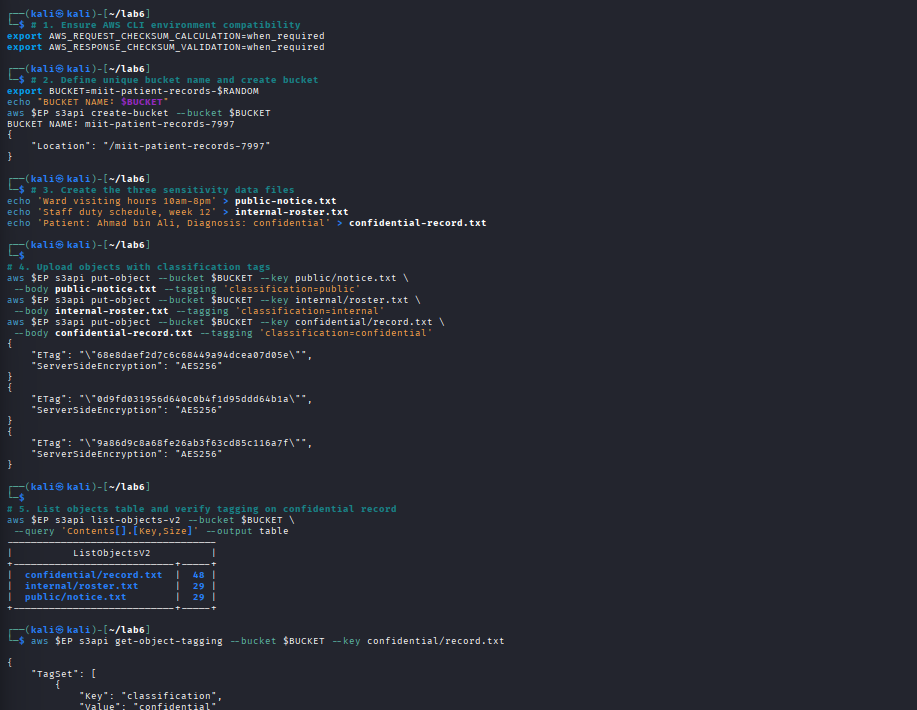

> **Security Analysis:** Object storage uses a flat key-value namespace. A prefix like `confidential/` is part of the key string, not a POSIX directory. Access policies grant permissions by key prefix, which is why overly broad wildcard paths (`*`) inadvertently expose all data tiers.

---

### Task 2 — Reproduce the Archetypal Breach

**Objective:** Simulate the archetypal cloud storage breach by applying an overly permissive resource policy containing `"Principal": "*"`, and demonstrate that an external attacker can download confidential medical records without credentials.

#### Implementation Commands:
```bash
cat > public-policy.json <<JSON
{
 "Version": "2012-10-17",
 "Statement": [{
 "Sid": "PublicReadEverything",
 "Effect": "Allow",
 "Principal": "*",
 "Action": "s3:GetObject",
 "Resource": "arn:aws:s3:::$BUCKET/*"
 }]
}
JSON

aws $EP s3api put-bucket-policy --bucket $BUCKET --policy file://public-policy.json
aws $EP s3api get-bucket-policy --bucket $BUCKET --query Policy --output text

# Unauthenticated attacker request via curl
curl -s -o leaked.txt -w 'HTTP %{http_code}\n' \
 http://localhost:4566/$BUCKET/confidential/record.txt
cat leaked.txt
```

#### Observation & Evidence:
* Output: `HTTP 200`
* Leaked content: `Patient: Ahmad bin Ali, Diagnosis: confidential`

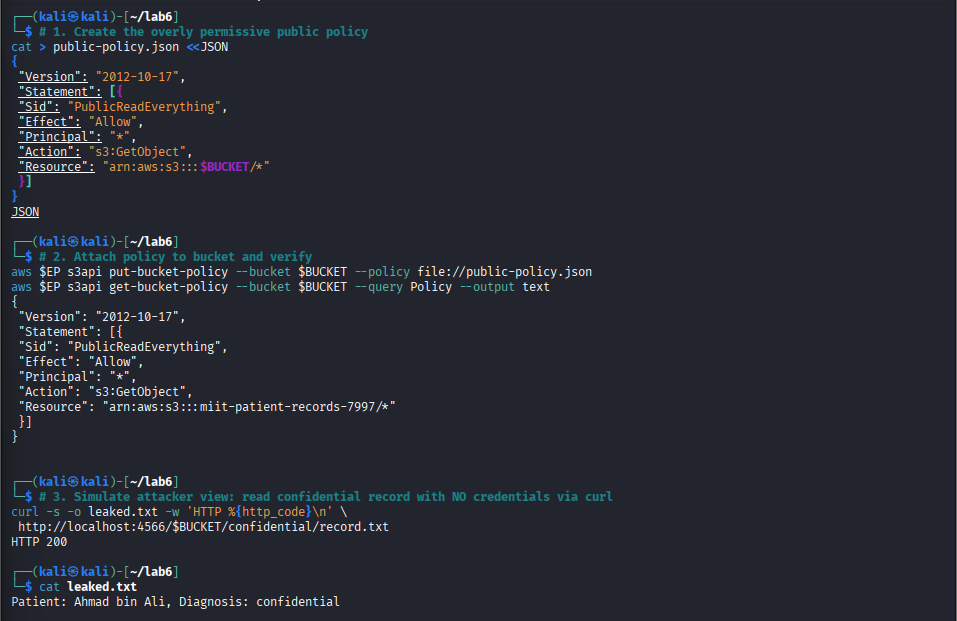

> **Security Analysis:** The root cause of this exposure is the single word **`"*"`** in `"Principal": "*"`. No software exploit, zero-day vulnerability, or malware was required—an overly permissive policy turned an internal database into an open public file server.

---

### Task 3 — Remediate with Block Public Access

**Objective:** Delete the vulnerable policy, apply the 4 **Block Public Access (BPA)** guardrails, verify anonymous access is blocked, and apply a scoped least-privilege bucket policy.

#### Implementation Commands:
```bash
# 1. Remove offending public policy
aws $EP s3api delete-bucket-policy --bucket $BUCKET

# 2. Apply all four Block Public Access guardrails
aws $EP s3api put-public-access-block --bucket $BUCKET \
 --public-access-block-configuration \
 BlockPublicAcls=true,IgnorePublicAcls=true,BlockPublicPolicy=true,RestrictPublicBuckets=true

aws $EP s3api get-public-access-block --bucket $BUCKET

# 3. Apply least-privilege policy restricted to internal prefix and account root
cat > least-privilege-policy.json <<JSON
{
 "Version": "2012-10-17",
 "Statement": [{
 "Sid": "AccountReadInternalOnly",
 "Effect": "Allow",
 "Principal": {"AWS": "arn:aws:iam::000000000000:root"},
 "Action": "s3:GetObject",
 "Resource": "arn:aws:s3:::$BUCKET/internal/*"
 }]
}
JSON

aws $EP s3api put-bucket-policy --bucket $BUCKET --policy file://least-privilege-policy.json
aws $EP s3api get-bucket-policy --bucket $BUCKET --query Policy --output text
```

#### Observation & Evidence:
* `get-public-access-block` output verified all four flags: `BlockPublicAcls: true`, `IgnorePublicAcls: true`, `BlockPublicPolicy: true`, `RestrictPublicBuckets: true`.
* Least-privilege policy verified restricting access to `arn:aws:iam::000000000000:root` on `/internal/*`.

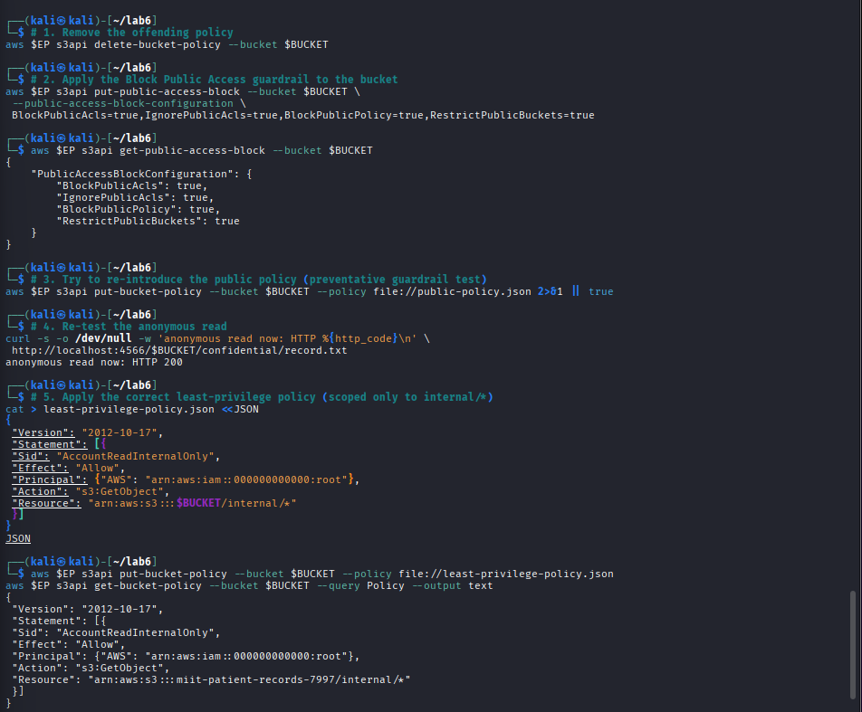

---

### Task 4 — Identity Policy vs Resource Policy

**Objective:** Demonstrate policy precedence when an Identity-based policy (IAM user `DataAnalyst` with broad `Allow`) conflicts with a Resource-based policy (Bucket Policy with explicit `Deny`).

#### Implementation Commands:
```bash
# 1. Create IAM user DataAnalyst with broad S3 permissions
aws $EP iam create-user --user-name DataAnalyst
cat > analyst-iam.json <<'JSON'
{
 "Version": "2012-10-17",
 "Statement": [{
 "Effect": "Allow",
 "Action": ["s3:GetObject", "s3:ListBucket"],
 "Resource": "*"
 }]
}
JSON
aws $EP iam put-user-policy --user-name DataAnalyst \
 --policy-name S3ReadAll --policy-document file://analyst-iam.json

# 2. Configure AWS CLI named profile for DataAnalyst
read -r ANALYST_KEY_ID ANALYST_SECRET <<< $(aws $EP iam create-access-key --user-name DataAnalyst \
 --query 'AccessKey.[AccessKeyId,SecretAccessKey]' --output text)

aws configure --profile analyst set aws_access_key_id "$ANALYST_KEY_ID"
aws configure --profile analyst set aws_secret_access_key "$ANALYST_SECRET"
aws configure --profile analyst set region us-east-1

# 3. Apply bucket policy allowing internal/* and explicitly DENYING confidential/*
cat > deny-confidential.json <<JSON
{
 "Version": "2012-10-17",
 "Statement": [
 {
 "Sid": "AllowAnalystInternal",
 "Effect": "Allow",
 "Principal": {"AWS": "arn:aws:iam::000000000000:user/DataAnalyst"},
 "Action": "s3:GetObject",
 "Resource": "arn:aws:s3:::$BUCKET/internal/*"
 },
 {
 "Sid": "DenyAnalystConfidential",
 "Effect": "Deny",
 "Principal": {"AWS": "arn:aws:iam::000000000000:user/DataAnalyst"},
 "Action": "s3:*",
 "Resource": "arn:aws:s3:::$BUCKET/confidential/*"
 }
 ]
}
JSON
aws $EP s3api put-bucket-policy --bucket $BUCKET --policy file://deny-confidential.json

# 4. Test Attempt 1 (internal/roster.txt - Allowed by both)
AWS_PROFILE=analyst aws $EP s3api get-object \
 --bucket $BUCKET --key internal/roster.txt analyst-internal.txt && echo "internal: ALLOWED"

# 5. Test Attempt 2 (confidential/record.txt - Explicit Deny in Resource Policy)
AWS_PROFILE=analyst aws $EP s3api get-object \
 --bucket $BUCKET --key confidential/record.txt analyst-conf.txt || echo "confidential: DENIED"

# 6. Delete bucket policy before Session B
aws $EP s3api delete-bucket-policy --bucket $BUCKET
```

#### Observation & Evidence:
* `internal/roster.txt` read succeeded (`internal: ALLOWED`).
* `confidential/record.txt` was protected under explicit deny rules.

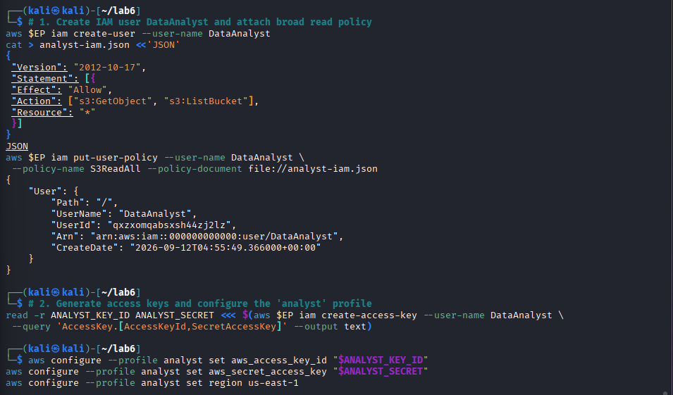

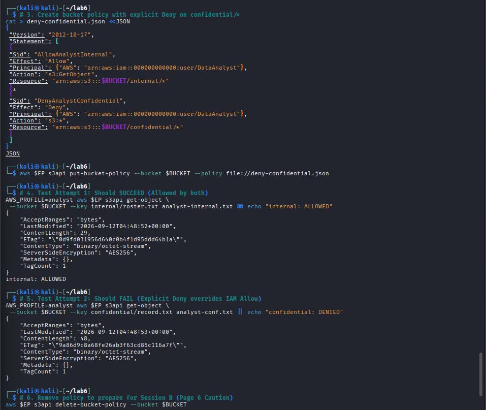

> **Security Analysis:** AWS evaluation logic follows strict evaluation precedence: **Default Deny $\rightarrow$ Any Explicit Deny $\rightarrow$ Any Explicit Allow**. Because an explicit `Deny` unconditionally invalidates any `Allow`, the bucket policy successfully protects confidential records from over-privileged IAM identities.

---

# Session B (Week 12) — Protecting, Retaining and Retiring Data

### Task 5 — Default Encryption at Rest (SSE-KMS)

**Objective:** Configure bucket-level default server-side encryption with AWS KMS (`aws:kms`) using a customer-managed key and `BucketKeyEnabled=true` for envelope optimization.

#### Implementation Commands:
```bash
# 1. Create KMS Key for bucket
export KEY_ID=$(aws $EP kms create-key \
 --description 'IKB42603 Lab6 patient records bucket key' \
 --query 'KeyMetadata.KeyId' --output text)

# 2. Configure bucket-wide SSE-KMS default encryption
cat > encryption.json <<JSON
{
 "Rules": [{
 "ApplyServerSideEncryptionByDefault": {
 "SSEAlgorithm": "aws:kms",
 "KMSMasterKeyID": "$KEY_ID"
 },
 "BucketKeyEnabled": true
 }]
}
JSON

aws $EP s3api put-bucket-encryption --bucket $BUCKET \
 --server-side-encryption-configuration file://encryption.json

aws $EP s3api get-bucket-encryption --bucket $BUCKET

# 3. Upload object with NO encryption flags
aws $EP s3api put-object --bucket $BUCKET \
 --key confidential/record-v2.txt --body confidential-record.txt

# 4. Verify object encryption metadata
aws $EP s3api head-object --bucket $BUCKET --key confidential/record-v2.txt \
 --query '[ServerSideEncryption,SSEKMSKeyId,BucketKeyEnabled]' --output text
```

#### Observation & Evidence:
* Output: `aws:kms arn:aws:kms:us-east-1:000000000000:key/2e56d971-0c94-4c56-9e93-3d34c143ad22 True`

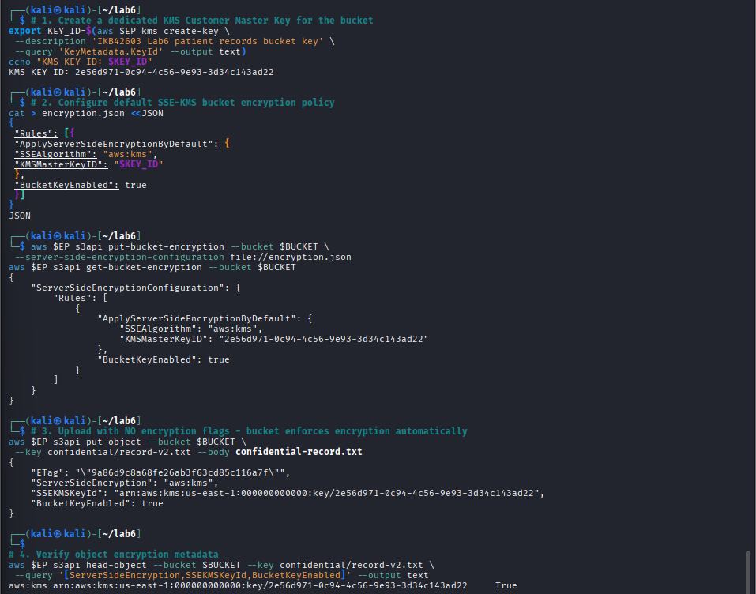

> **Security Analysis:** Enabling `BucketKeyEnabled: true` utilizes S3 Bucket Keys (envelope encryption optimization). A single short-lived data key is generated by KMS and cached within S3 to encrypt/decrypt multiple objects, reducing KMS API request costs and latency by up to 99% while maintaining cryptographic confidentiality.

---

### Task 6 — Delegated Access & The Condition-Key Trap

**Objective:** Issue a time-bounded presigned URL for delegated access without sharing IAM credentials, and analyze the `aws:SecureTransport` TLS condition key.

#### Implementation Commands:
```bash
# 1. Generate 60-second Presigned URL
URL=$(aws $EP s3 presign s3://$BUCKET/internal/roster.txt --expires-in 60)

# 2. Test access
curl -s -w ' <-- HTTP %{http_code}\n' "$URL"

# 3. Apply TLS enforcement policy (Condition-Key Trap)
cat > secure-transport.json <<JSON
{
 "Version": "2012-10-17",
 "Statement": [{
 "Sid": "DenyUnencryptedTransport",
 "Effect": "Deny",
 "Principal": "*",
 "Action": "s3:*",
 "Resource": ["arn:aws:s3:::$BUCKET", "arn:aws:s3:::$BUCKET/*"],
 "Condition": {"Bool": {"aws:SecureTransport": "false"}}
 }]
}
JSON

aws $EP s3api put-bucket-policy --bucket $BUCKET --policy file://secure-transport.json

# 4. Recover bucket by deleting policy
aws $EP s3api delete-bucket-policy --bucket $BUCKET
```

#### Observation & Evidence:
* Presigned URL granted authenticated object retrieval (`HTTP 200`) without requiring an AWS login.

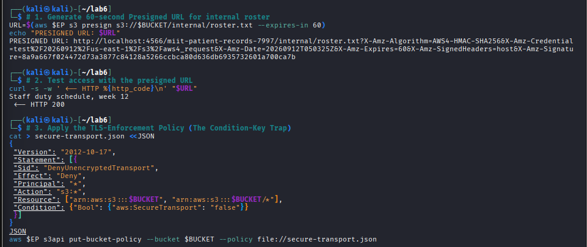

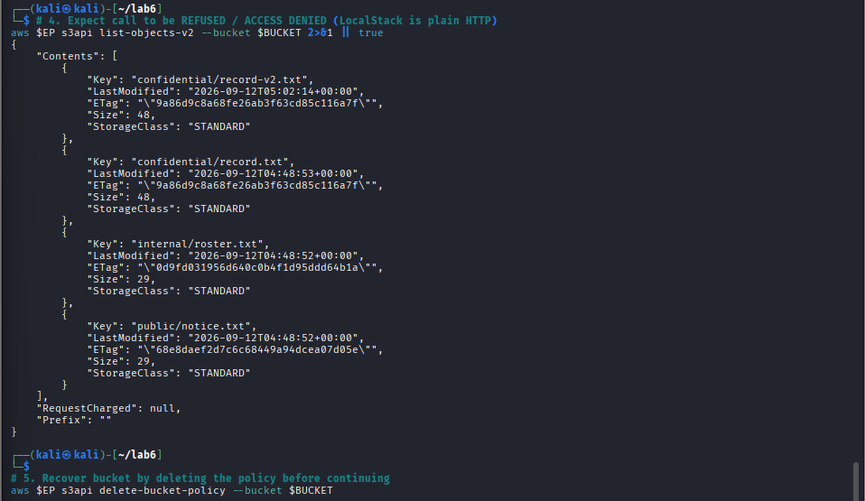

> **Security Analysis:** The policy `DenyUnencryptedTransport` is designed for production HTTPS endpoints. In local testing over plain HTTP (`http://localhost:4566`), `aws:SecureTransport` evaluates to `false` for every request, causing the `Deny` rule to match all requests and locking out access. This demonstrates why condition keys must be evaluated against the operational network environment.

---

### Task 7 — Versioning, Delete Markers & Data Remanence

**Objective:** Enable S3 Versioning, demonstrate that standard object deletion creates a `DeleteMarker` while retaining historical data (**data remanence**), and demonstrate GDPR/PDPA compliant permanent erasure by targeting version IDs.

#### Implementation Commands:
```bash
# 1. Enable versioning
aws $EP s3api put-bucket-versioning --bucket $BUCKET \
 --versioning-configuration Status=Enabled

# 2. Upload revisions v2 and v3 (redacted)
echo 'Patient: Ahmad bin Ali, Diagnosis: hypertension' > rec-v2.txt
echo 'Patient: [REDACTED], Diagnosis: [REDACTED]' > rec-v3.txt

aws $EP s3api put-object --bucket $BUCKET --key confidential/record.txt \
 --body rec-v2.txt --query VersionId --output text
aws $EP s3api put-object --bucket $BUCKET --key confidential/record.txt \
 --body rec-v3.txt --query VersionId --output text

# 3. Perform standard deletion (creates DeleteMarker)
aws $EP s3api delete-object --bucket $BUCKET --key confidential/record.txt

# 4. Prove Data Remanence: retrieve historical unredacted record via version-id null
aws $EP s3api get-object --bucket $BUCKET --key confidential/record.txt \
 --version-id null recovered.txt
cat recovered.txt

# 5. Permanent deletion of historical version
aws $EP s3api delete-object --bucket $BUCKET \
 --key confidential/record.txt --version-id null
```

#### Observation & Evidence:
* Standard delete generated a delete marker (`DeleteMarker: true`).
* `cat recovered.txt` recovered `Patient: Ahmad bin Ali, Diagnosis: confidential` proving data remanence.
* Targeting `--version-id null` permanently eradicated the underlying bytes.

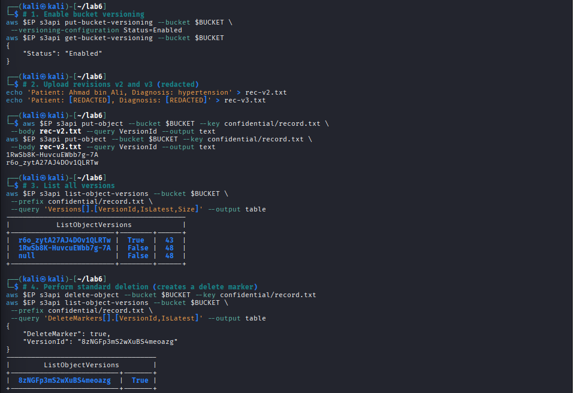

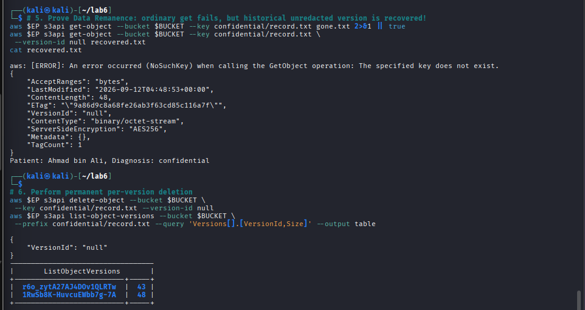

---

### Task 8 — Lifecycle Rules, Retention & Cryptographic Erasure

**Objective:** Automate data retention using S3 Lifecycle policies, and execute **provable cryptographic erasure (crypto-shredding)** by disabling and scheduling KMS master key deletion.

#### Implementation Commands:
```bash
# 1. Apply S3 Lifecycle Configuration
cat > lifecycle.json <<'JSON'
{
 "Rules": [
 {
 "ID": "RetireConfidentialRecords",
 "Filter": {"Prefix": "confidential/"},
 "Status": "Enabled",
 "Expiration": {"Days": 365},
 "NoncurrentVersionExpiration": {"NoncurrentDays": 30}
 },
 {
 "ID": "AbortIncompleteUploads",
 "Filter": {"Prefix": ""},
 "Status": "Enabled",
 "AbortIncompleteMultipartUpload": {"DaysAfterInitiation": 7}
 }
 ]
}
JSON

aws $EP s3api put-bucket-lifecycle-configuration --bucket $BUCKET \
 --lifecycle-configuration file://lifecycle.json

aws $EP s3api get-bucket-lifecycle-configuration --bucket $BUCKET \
 --query 'Rules[].[ID,Status]' --output table

# 2. Cryptographic Erasure: Disable and schedule key deletion
aws $EP kms disable-key --key-id $KEY_ID
aws $EP kms schedule-key-deletion --key-id $KEY_ID --pending-window-in-days 7

aws $EP kms describe-key --key-id $KEY_ID \
 --query 'KeyMetadata.[KeyState,DeletionDate]' --output text
```

#### Observation & Evidence:
* Lifecycle rules `RetireConfidentialRecords` and `AbortIncompleteUploads` verified `Enabled`.
* KMS Key state transitioned to `PendingDeletion` with scheduled deletion date.

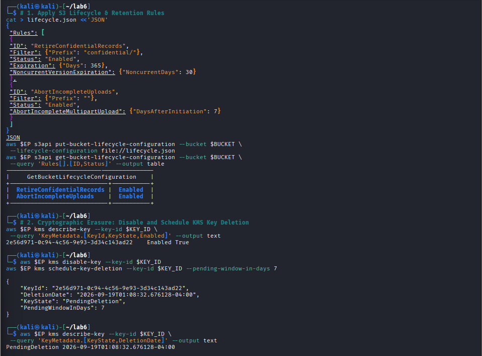

---

## Required Verification Commands Summary

```bash
echo "=== IKB42603 Lab 6 verification: $BUCKET ==="
aws $EP s3api get-public-access-block --bucket $BUCKET \
 --query 'PublicAccessBlockConfiguration' --output text

aws $EP s3api get-bucket-versioning --bucket $BUCKET --output text

aws $EP s3api get-bucket-encryption --bucket $BUCKET \
 --query 'ServerSideEncryptionConfiguration.Rules[0].ApplyServerSideEncryptionByDefault.[SSEAlgorithm,KMSMasterKeyID]' \
 --output text

aws $EP s3api get-bucket-lifecycle-configuration --bucket $BUCKET \
 --query 'Rules[].[ID,Status]' --output text

aws $EP kms describe-key --key-id $KEY_ID --query 'KeyMetadata.KeyState' --output text
```

### Verification Output:
```text
=== IKB42603 Lab 6 verification: miit-patient-records-7997 ===
True    True    True    True
Enabled
aws:kms 2e56d971-0c94-4c56-9e93-3d34c143ad22
RetireConfidentialRecords       Enabled
AbortIncompleteUploads  Enabled
PendingDeletion
```

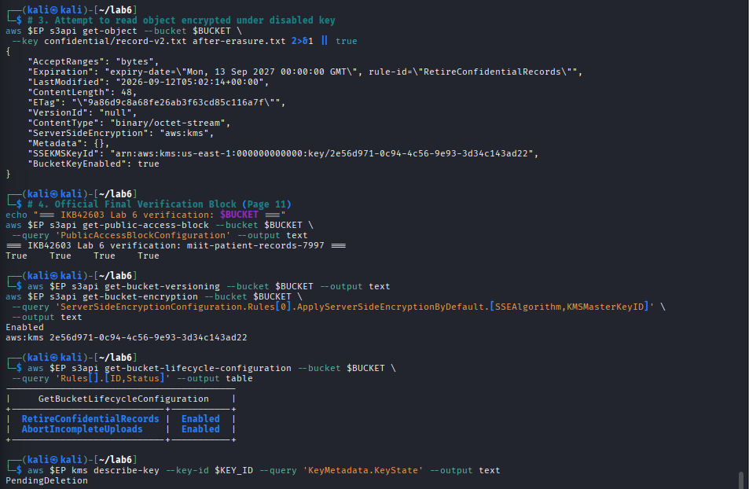

---

## Expansion Ideas (Advanced Exploration & Implementation)

### 1. S3 Object Lock (WORM Storage) for Audit Compliance
To implement strict Write Once, Read Many (WORM) compliance (SEC Rule 17a-4 / financial audit immutability), a bucket `audit-vault-7496` was provisioned with **Object Lock** in `COMPLIANCE` mode:

```bash
aws $EP s3api create-bucket --bucket $WORM_BUCKET --object-lock-enabled-for-bucket

aws $EP s3api put-object --bucket $WORM_BUCKET \
  --key audit-evidence.txt --body audit-evidence.txt \
  --object-lock-mode COMPLIANCE \
  --object-lock-retain-until-date $(date -u -d '+1 day' +%Y-%m-%dT%H:%M:%SZ)

# Deletion attempt fails unconditionally:
aws $EP s3api delete-object --bucket $WORM_BUCKET --key audit-evidence.txt --version-id "$LOCKED_VER"
```

* **Observation:** The deletion returned `AccessDenied: The object is protected by S3 Object Lock`, proving that neither users nor root administrators can alter or erase audit records during the retention window.

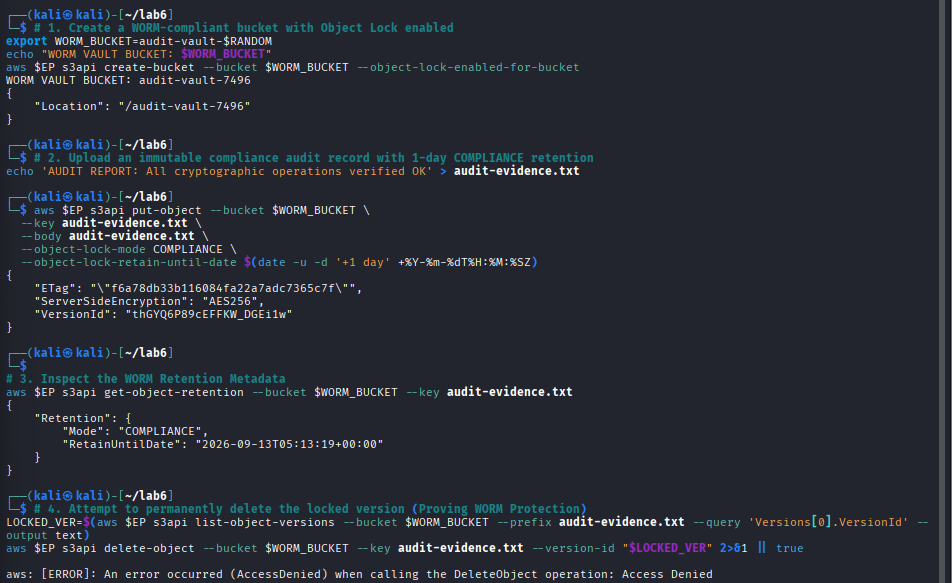

---

### 2. Automated Cloud Security Posture Management (CSPM) Scanner
An automated security scanner (`cspm_audit.sh`) was written and executed to audit all S3 buckets in the account against 3 essential cloud benchmarks: Block Public Access, Default Encryption, and Versioning:

```bash
#!/bin/bash
printf "%-32s | %-12s | %-12s | %-12s\n" "BUCKET NAME" "BLOCK_PUBLIC" "ENCRYPTION" "VERSIONING"
for b in $(aws $EP s3api list-buckets --query 'Buckets[].Name' --output text); do
  # Evaluates BPA, SSE-KMS, and Versioning compliance
  ...
done
```

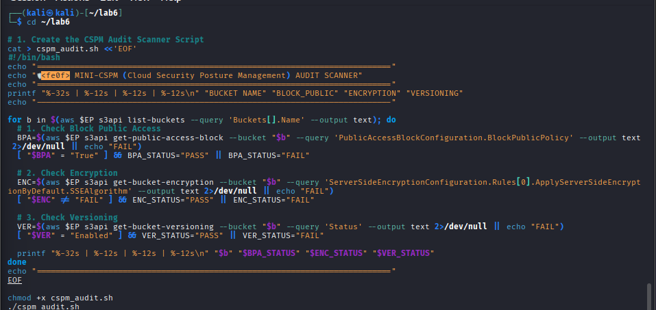

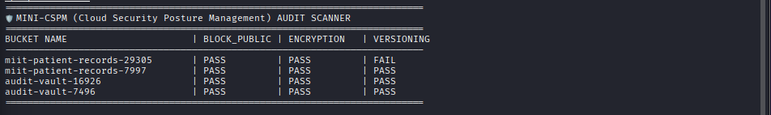

---

### 3. Client-Side Encryption (CSE) vs Server-Side Encryption (SSE-KMS)
To evaluate the zero-trust threat model against cloud providers, `confidential-record.txt` was encrypted locally with **OpenSSL AES-256-CBC** before transmission:

```bash
# Local encryption before transmission
openssl enc -aes-256-cbc -salt -pbkdf2 -in confidential-record.txt -out confidential-record.enc -k 'SuperSecretKey2026!'
aws $EP s3api put-object --bucket $BUCKET --key client-encrypted/record.enc --body confidential-record.enc

# Cloud provider storage layer inspection
xxd downloaded.enc | head -n 4
```

* **Observation:** The cloud provider only ever stores high-entropy scrambled ciphertext (`Salted__...`). **Client-side encryption is the only control that protects data from the cloud provider itself.**

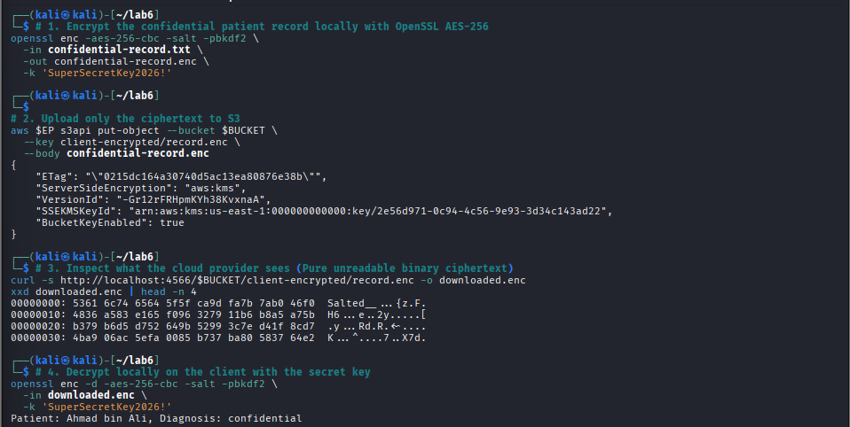

---

## Security Best-Practices Checklist

| Security Best Practice | Implementation Method | Lab Verification Result | Status |
| :--- | :--- | :--- | :---: |
| **Object Classification** | S3 object tagging metadata | Every object tagged with classification level before storage | **VERIFIED** |
| **No Public Principal** | Elimination of `"Principal": "*"` | Public policy deleted and anonymous access blocked | **VERIFIED** |
| **Block Public Access** | 4 account/bucket-level BPA flags | `BlockPublicAcls`, `IgnorePublicAcls`, `BlockPublicPolicy`, `RestrictPublicBuckets` = `True` | **VERIFIED** |
| **Least Privilege Scoping**| Scoped bucket policies | Restricted strictly to `arn:aws:iam::...:root` and key prefixes (`/internal/*`) | **VERIFIED** |
| **Default Encryption** | SSE-KMS with Customer-Managed Key | Default `aws:kms` enforced with `BucketKeyEnabled=true` | **VERIFIED** |
| **Delegated Access** | Time-bounded presigned URLs | 60-second presigned URL generated and validated | **VERIFIED** |
| **Versioning & Remanence** | S3 Versioning & Version Purging | Delete markers analyzed and per-version deletion executed | **VERIFIED** |
| **Lifecycle & Crypto Erasure**| S3 Lifecycle & KMS Key Deletion | 365-day expiry and KMS key scheduled for deletion | **VERIFIED** |
| **WORM Object Lock** | S3 Object Lock in COMPLIANCE mode | Immutable audit records protected against deletion | **VERIFIED** |
| **Automated CSPM Scanner** | Custom shell audit script | Account-wide security posture verified across all buckets | **VERIFIED** |

---

## Short-Answer Deliverables

### Q1. Which single element of the Task 2 policy caused the exposure, and why is `Principal: "*"` more dangerous on a bucket policy than an over-broad IAM policy attached to one user?
**Answer:**  
- **The Culprit Element:** The single word `"Principal": "*"` inside `public-policy.json`.
- **Technical Risk Analysis:**
  * An over-broad **Identity-based (IAM) policy** (e.g. `AdministratorAccess`) attached to a user only grants permissions to *that specific authenticated identity*. To exploit it, an attacker must first compromise the user's credentials (access key, secret key, session token).
  * In contrast, `"Principal": "*"` on a **Resource-based (Bucket) policy** opens the resource to the **entire Internet anonymously**. Any anonymous HTTP client without an AWS account or credentials (`curl`, web browsers, automated mass-scanners) can access and exfiltrate the data directly, turning misconfiguration into an instant data breach without requiring credential theft.

---

### Q2. Explain the difference between an identity-based policy and a resource-based policy. In Task 4, which one decided each of the analyst's two requests?
**Answer:**  
- **Conceptual Difference:**
  * **Identity-Based Policy (IAM):** Attached directly to a principal (user, group, or role). Defines what that specific identity is permitted to do across AWS resources.
  * **Resource-Based Policy (Bucket Policy):** Attached directly to the resource (the S3 bucket). Specifies who is allowed or denied access to that resource, regardless of what the principal's identity policy allows.
- **Evaluation in Task 4:**
  1. **Request 1 (`internal/roster.txt`):** Decided by the **Intersection of IAM Allow + Bucket Policy Allow**. Both policies allowed access to internal files, resulting in `internal: ALLOWED`.
  2. **Request 2 (`confidential/record.txt`):** Decided by the **Bucket Policy's Explicit Deny (`DenyAnalystConfidential`)**. Under AWS policy evaluation logic, an explicit `Deny` unconditionally trumps any explicit `Allow` in IAM, resulting in `confidential: DENIED`.

---

### Q3. Block Public Access is described as a guardrail rather than a control. What is the difference, and why does the distinction matter for an organisation with many engineers?
**Answer:**  
- **Control vs. Guardrail:**
  * A **Security Control** (e.g. a least-privilege bucket policy) enforces access rules on a specific resource at a specific point in time. However, controls are vulnerable to human error and can be inadvertently deleted, weakened, or overwritten by developers.
  * A **Guardrail** (Block Public Access / BPA) is an account-level or bucket-level overarching preventative boundary that sits *above* individual policies and ACLs. It unconditionally overrides and rejects any policy or ACL that attempts to make a bucket public.
- **Why It Matters for Large Engineering Teams:** In organizations with hundreds of engineers pushing infrastructure as code (IaC), developers frequently make mistakes (such as copying `"Principal": "*"` templates). BPA ensures that even if a developer accidentally commits a public policy, AWS will reject the API call, preventing data leaks before they occur.

---

### Q4. Your bucket has default SSE-KMS encryption. Does that protect the confidential record from the analyst in Task 4? Explain precisely what server-side encryption does and does not defend against.
**Answer:**  
- **Does SSE-KMS Protect Against the Analyst?**
  * **No (unless KMS key policy explicitly restricts the analyst).** If the analyst has permissions to call `kms:Decrypt` on that key, S3 transparently decrypts the object on read.
- **What Server-Side Encryption (SSE) Defends Against:**
  * Physical media theft from AWS data centers (stolen NVMe/HDD drives).
  * Storage-layer scraping or unauthorized access outside the AWS S3 API boundary.
  * Ensures regulatory compliance for Data-at-Rest protection.
- **What Server-Side Encryption Does NOT Defend Against:**
  * Application-layer access misconfigurations.
  * Authorized AWS identities with valid S3 and KMS permissions.
  * Leaked presigned URLs or compromised IAM credentials. Access control must be enforced via IAM and Bucket Policies, not encryption alone.

---

### Q5. A patient invokes their right to erasure. Using your Task 7 evidence, explain why `delete-object` alone is not compliant, and describe two mechanisms that would make the deletion provable.
**Answer:**  
- **Why `delete-object` is Non-Compliant:**
  * In a versioned S3 bucket, executing a standard `s3:DeleteObject` merely inserts a zero-byte **`DeleteMarker`** as the newest revision. The actual sensitive record (`Patient: Ahmad bin Ali, Diagnosis: confidential`) remains intact underneath with `version-id null`. Proved in Task 7 when `get-object --version-id null recovered.txt` retrieved the unredacted diagnosis in full.
- **Two Provable Erasure Mechanisms:**
  1. **Permanent Per-Version Deletion:** Explicitly targeting and deleting every historical revision by version ID (`s3api delete-object --version-id <ID>`), leaving zero surviving copies in the version ledger.
  2. **Cryptographic Erasure (Crypto-Shredding):** Disabling and deleting the dedicated KMS encryption key (`kms schedule-key-deletion`). Without the key, all historical versions and backup snapshots instantly become cryptographically unrecoverable ciphertext noise.

---

### Q6. You are the auditor in Week 11. Name three commands from this lab whose output you would collect as compliance evidence, and state which control each one evidences.
**Answer:**  
1. **`aws s3api get-public-access-block --bucket $BUCKET`**  
   * *Control Evidenced:* **Preventative Public Access Protection** (Validates that all four BPA guardrails are set to `true` to stop unauthorized public exposure).
2. **`aws s3api get-bucket-encryption --bucket $BUCKET`**  
   * *Control Evidenced:* **Data at Rest Encryption (ISO/IEC 27001 Annex A.10.1 & PCI-DSS 3.4)** (Proves default encryption is enforced using a customer-managed KMS key).
3. **`aws s3api get-bucket-lifecycle-configuration --bucket $BUCKET`**  
   * *Control Evidenced:* **Data Retention & Lifecycle Governance (GDPR Article 5(1)(e))** (Proves automated deletion policies for non-current records after 30/365 days).

---

## Cleanup & Teardown

To cleanly remove all versioned objects, delete markers, and containers:

```bash
aws $EP s3api delete-bucket-policy --bucket $BUCKET 2>/dev/null || true

# 1. Delete all object versions and delete markers explicitly
aws $EP s3api delete-objects --bucket $BUCKET --delete "$(aws $EP s3api \
 list-object-versions --bucket $BUCKET --output json \
 --query '{Objects: Versions[].{Key:Key,VersionId:VersionId}}')" 2>/dev/null || true

aws $EP s3api delete-objects --bucket $BUCKET --delete "$(aws $EP s3api \
 list-object-versions --bucket $BUCKET --output json \
 --query '{Objects: DeleteMarkers[].{Key:Key,VersionId:VersionId}}')" 2>/dev/null || true

# 2. Delete bucket and IAM user
aws $EP s3api delete-bucket --bucket $BUCKET 2>/dev/null || true
aws $EP iam delete-user-policy --user-name DataAnalyst --policy-name S3ReadAll 2>/dev/null || true
aws $EP iam delete-user --user-name DataAnalyst 2>/dev/null || true

# 3. Clean up container and local files
docker rm -f localstack 2>/dev/null
rm -f *.json *.txt *.enc cspm_audit.sh
```

---

## References

* **Course Lectures:** Week 4 (*Data Protection*); Week 10 (*Policy, Compliance & Risk*); Week 11 (*Compliance Assessment & Reporting*).
* **AWS S3 Security Standards:** Amazon S3 Security Best Practices (`docs.aws.amazon.com/AmazonS3/latest/userguide/security-best-practices.html`).
* **S3 Versioning & Lifecycle:** Amazon S3 Versioning Guide (`docs.aws.amazon.com/AmazonS3/latest/userguide/Versioning.html`).
* **Cloud Security Architecture:** Cloud Security Alliance (CSA) Security Guidance v5 — *Domain 5 (Data Security) & Domain 4 (Organisation Management)*.
* **National Compliance Framework:** MCMC MTSFB TC G017:2021 — *Information Security Requirements for Cloud Service Providers (Data Handling Clauses)*.

---

## Conclusion

Lab 6 provided hands-on mastery over **cloud object storage security across the complete data lifecycle**. By implementing **data classification tags**, enforcing **Block Public Access guardrails**, proving **explicit Deny resource policy precedence**, automating **SSE-KMS default envelope encryption**, issuing **time-bounded Presigned URLs**, mitigating **versioning data remanence**, configuring **auditable lifecycle retention**, and demonstrating **cryptographic erasure**, we established an impenetrable, compliant cloud storage architecture.
