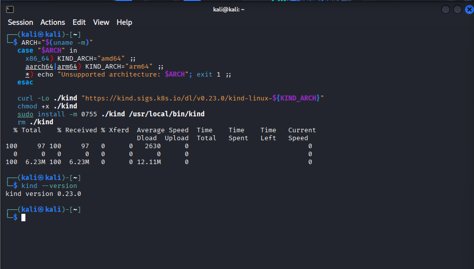
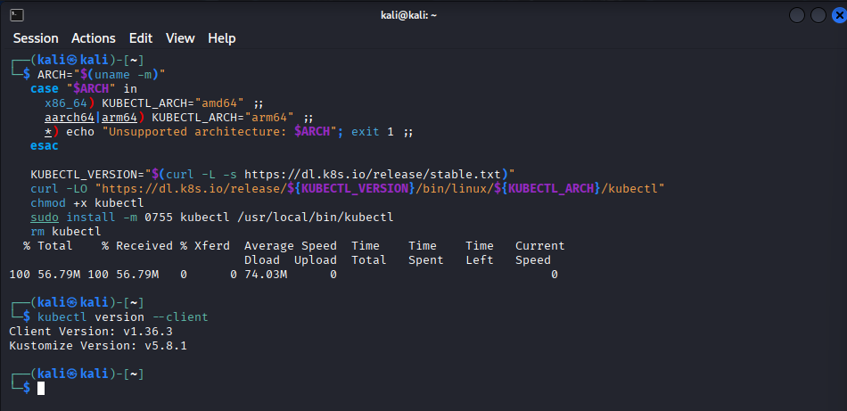
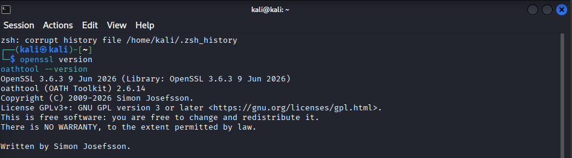
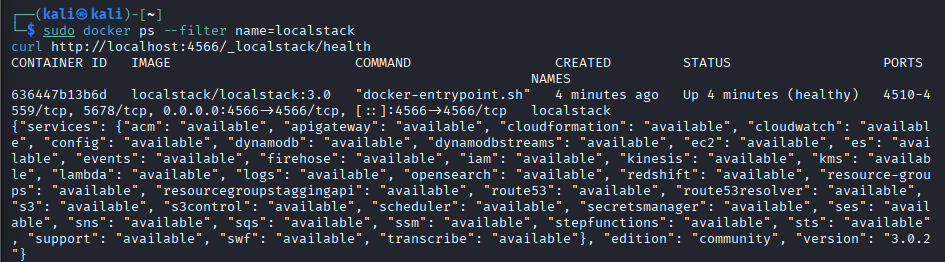
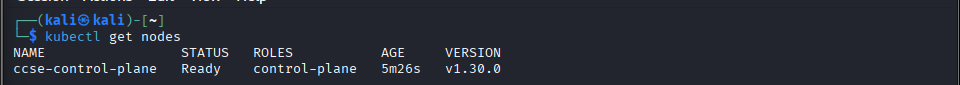
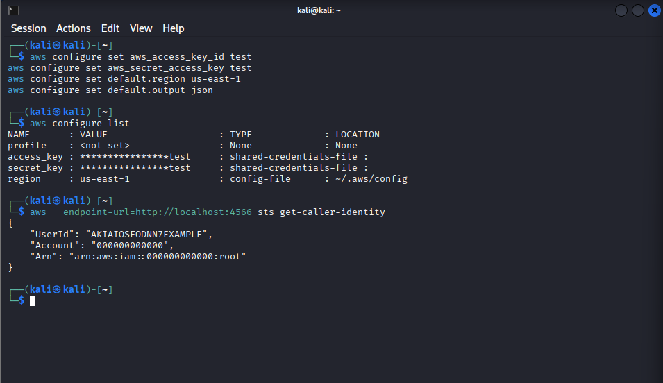

# IKB42603 Lab 0: Environment Setup Report

**Course:** IKB42603 Cloud Computing Security Essentials
**Lab:** Lab 0 - Environment Setup
**Student Name:** WAN MUHAMMAD NUR IMAN BIN WAN ISMAIL
**Student ID:** 52215225039
**Date:** 28 July 2026
**Environment:** Kali Linux

## Objective

The objective of this lab is to prepare a secure local environment for the remaining cloud security labs. Docker runs LocalStack and kind, LocalStack simulates AWS services without using a real AWS account, and kind provides a local Kubernetes cluster for RBAC activities in Lab 1.

## Environment Summary

The following versions and status values were verified on Kali Linux. The corresponding screenshots are stored in `Evidence/`.

| Component | Verification command | Recorded version/status | Evidence file |
| --- | --- | --- | --- |
| Docker | `docker --version` | `28.5.2+dfsg4` | `docker-version-and-hello-world.png` |
| AWS CLI v2 | `aws --version` | `2.36.10` | `aws-cli-version.png` |
| kind | `kind --version` | `0.23.0` | `kind-version.png` |
| kubectl | `kubectl version --client` | Client `v1.36.3`, Kustomize `v5.8.1` | `kubectl-version.png` |
| OpenSSL | `openssl version` | `3.6.3` | `helper-tools.png` |
| oathtool | `oathtool --version` | OATH Toolkit `2.6.14` | `helper-tools.png` |
| LocalStack | `curl http://localhost:4566/_localstack/health` | LocalStack `3.0.2`, services available on port `4566` | `localstack-container-and-health.png` |
| kind cluster | `kubectl get nodes` | `ccse-control-plane` Ready, Kubernetes `v1.30.0` | `kind-cluster-ready.png` |
| LocalStack AWS CLI | `aws $EP sts get-caller-identity` | Account `000000000000` | `aws-cli-localstack-sts.png` |

## System Requirements

This setup was completed for a Kali Linux environment. Kali is Debian-based, so the required packages are installed with `apt`. Run the commands from a terminal with an account that can use `sudo`.

- Kali Linux with an active Internet connection
- At least 4 GB RAM and 10 GB free disk space
- `sudo` access
- A supported CPU architecture (`amd64` or `arm64`)

Update the package index and install the utilities used by the remaining steps:

```bash
sudo apt update
sudo apt install -y ca-certificates curl unzip
```


## Tool Installations

### Docker

Docker provides the container runtime used to start LocalStack.

1. Install Docker from the Kali repository.

   ```bash
   sudo apt install -y docker.io
   ```

2. Enable and start the Docker service.

   ```bash
   sudo systemctl enable --now docker
   ```

3. Allow the current user to run Docker commands without typing `sudo`.

   ```bash
   sudo usermod -aG docker "$USER"
   ```

   Log out and log back in after this command for the group change to take effect. Until then, prefix Docker commands with `sudo`.

4. Verify the installation.

   ```bash
   docker --version
   sudo docker run --rm hello-world
   ```

   Expected output resembles:

   ```text
   Docker version 20.10.x, build xxxxxxx
   Hello from Docker!
   ```


### AWS CLI v2

The AWS CLI is used to send API requests to the local AWS-compatible LocalStack endpoint.

1. Download and install the AWS CLI v2 bundle for the current CPU architecture.

   ```bash
   ARCH="$(uname -m)"
   case "$ARCH" in
     x86_64) AWS_ARCH="x86_64" ;;
     aarch64|arm64) AWS_ARCH="aarch64" ;;
     *) echo "Unsupported architecture: $ARCH"; exit 1 ;;
   esac

   curl "https://awscli.amazonaws.com/awscli-exe-linux-${AWS_ARCH}.zip" -o awscliv2.zip
   unzip -q awscliv2.zip
   sudo ./aws/install --update
   rm -rf aws awscliv2.zip
   ```

2. Verify the installation.

   ```bash
   aws --version
   ```

   Expected output resembles:

   ```text
   aws-cli/2.x.x Python/3.x.x Linux/x.x.x botocore/2.x.x
   ```


### kind

kind (Kubernetes IN Docker) creates Kubernetes clusters using Docker containers.

1. Download the kind binary for the current architecture and install it.

   ```bash
   ARCH="$(uname -m)"
   case "$ARCH" in
     x86_64) KIND_ARCH="amd64" ;;
     aarch64|arm64) KIND_ARCH="arm64" ;;
     *) echo "Unsupported architecture: $ARCH"; exit 1 ;;
   esac

   curl -Lo ./kind "https://kind.sigs.k8s.io/dl/v0.23.0/kind-linux-${KIND_ARCH}"
   chmod +x ./kind
   sudo install -m 0755 ./kind /usr/local/bin/kind
   rm ./kind
   ```

2. Verify the installation.

   ```bash
   kind --version
   ```

   Expected output:

   ```text
   kind v0.23.0 go1.x.x linux/amd64
   ```



### kubectl

`kubectl` is the command-line client used to manage Kubernetes clusters.

1. Download the stable `kubectl` binary for the current architecture and install it.

   ```bash
   ARCH="$(uname -m)"
   case "$ARCH" in
     x86_64) KUBECTL_ARCH="amd64" ;;
     aarch64|arm64) KUBECTL_ARCH="arm64" ;;
     *) echo "Unsupported architecture: $ARCH"; exit 1 ;;
   esac

   KUBECTL_VERSION="$(curl -L -s https://dl.k8s.io/release/stable.txt)"
   curl -LO "https://dl.k8s.io/release/${KUBECTL_VERSION}/bin/linux/${KUBECTL_ARCH}/kubectl"
   chmod +x kubectl
   sudo install -m 0755 kubectl /usr/local/bin/kubectl
   rm kubectl
   ```

2. Verify the installation.

   ```bash
   kubectl version --client
   ```

   Expected output resembles:

   ```text
   Client Version: v1.x.x
   Kustomize Version: v5.x.x
   ```



### Helper Tools

OpenSSL is required for encryption and certificate activities. `oathtool` is used to generate TOTP codes for multi-factor authentication activities in later labs.

```bash
sudo apt install -y openssl oathtool
openssl version
oathtool --version
```

Expected output resembles:

```text
OpenSSL 3.6.3
oathtool (OATH Toolkit) 2.6.14
```



## LocalStack Initialization

LocalStack emulates AWS services locally. Start it in a separate terminal. This command occupies that terminal while LocalStack is running:

```bash
sudo docker run --rm -p 4566:4566 localstack/localstack:3.0
```

For a detached session, add `-d`:

```bash
sudo docker run --rm -d --name localstack -p 4566:4566 localstack/localstack:3.0
```

Verify that the container is running and that the LocalStack health endpoint is reachable:

```bash
sudo docker ps --filter name=localstack
curl http://localhost:4566/_localstack/health
```

Expected output resembles:

```text
CONTAINER ID   IMAGE                       ...   PORTS
xxxxxxxxxxxx   localstack/localstack:3.0   ...   0.0.0.0:4566->4566/tcp
{"services": { ... }}
```



## Kubernetes Cluster Initialization

Create the local kind cluster required for Kubernetes RBAC exercises in Lab 1:

```bash
kind create cluster --name ccse
kubectl get nodes
```

Expected output resembles:

```text
NAME                 STATUS   ROLES           AGE   VERSION
ccse-control-plane   Ready    control-plane   ...   v1.30.0
```



## AWS CLI Configuration

The following are LocalStack-only dummy credentials. They do not grant access to an AWS account and must not be replaced with real credentials for this lab.

Configure the default AWS CLI profile:

```bash
aws configure set aws_access_key_id test
aws configure set aws_secret_access_key test
aws configure set default.region us-east-1
aws configure set default.output json
```

Store the LocalStack endpoint in a shell variable for the current terminal session. This prevents commands from being sent to a real AWS endpoint.

```bash
EP='--endpoint-url=http://localhost:4566'
```

Confirm the settings:

```bash
aws configure list
```

Expected output resembles:

```text
      Name                    Value             Type    Location
      ----                    -----             ----    --------
   access_key     ****************test      config-file    ~/.aws/credentials
   secret_key     ****************test      config-file    ~/.aws/credentials
       region                us-east-1      config-file    ~/.aws/config
```

Test the configured CLI against LocalStack, explicitly directing the request to the local endpoint:

```bash
aws $EP sts get-caller-identity
```

Expected output resembles:

```json
{
  "UserId": "...",
  "Account": "000000000000",
  "Arn": "arn:aws:iam::000000000000:root"
}
```



## Pre-Lab Verification Checklist

| Check | Command | Status |
| --- | --- | --- |
| Docker installed | `docker --version` | Completed |
| Docker can run containers | `docker run --rm hello-world` | Completed |
| AWS CLI v2 installed | `aws --version` | Completed |
| kind installed | `kind --version` | Completed |
| kubectl installed | `kubectl version --client` | Completed |
| OpenSSL installed | `openssl version` | Completed |
| oathtool installed | `oathtool --version` | Completed |
| LocalStack healthy | `curl http://localhost:4566/_localstack/health` | Completed |
| kind cluster ready | `kubectl get nodes` | Completed |
| LocalStack identity works | `aws $EP sts get-caller-identity` | Completed |

## Troubleshooting Notes

| Problem | Resolution |
| --- | --- |
| Cannot connect to the Docker daemon | Start Docker with `sudo systemctl enable --now docker`, then log out and back in after adding your user to the `docker` group. |
| Port `4566` is already in use | Stop the old container with `sudo docker rm -f localstack`, then start LocalStack again. |
| AWS CLI cannot reach LocalStack | Confirm LocalStack is running and use `aws $EP ...` in the current terminal. |
| kind cluster creation fails | Confirm Docker is running and use `kind delete cluster --name ccse` before recreating the cluster. |

## Conclusion

The Kali Linux environment was prepared with Docker, AWS CLI v2, kind, kubectl, OpenSSL, oathtool, LocalStack, and a local kind Kubernetes cluster. All AWS CLI testing was directed to LocalStack using dummy credentials. The environment is ready for Lab 1: Account Security and IAM.
